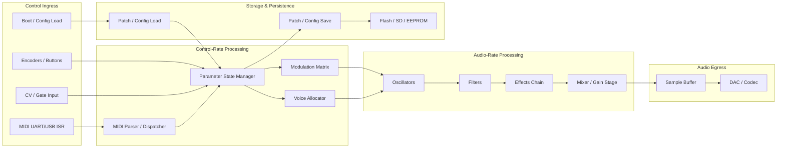

<!--
SPDX-License-Identifier: Apache-2.0
Copyright (c) 2026 David303ttl
-->

# RE-STAGE1-EMBEDDED-SYNTH-MASTER — Stage 1 Reverse Engineering Master Schema

> **Schema ID:** `RE-STAGE1-EMBEDDED-SYNTH-MASTER`
> **Version:** `6.0`
> **Date:** `2026-06-11`
> **Status:** `Active`
> **Supersedes:** `stage1-master-schema-corrected.md` (v5.8)
>
> **Purpose:** Reusable professional reverse-engineering framework for embedded synthesizer/audio firmware. This document defines the core Stage 1 methodology plus the embedded synthesizer domain profile. Architecture profiles are additive — enable the profiles matching the target firmware. Project-specific material lives in project overlays and must not weaken core evidence, citation, trace, risk, or closeout rules.
>
> **Layered structure:**
> - Layer 1: Core Stage 1 Schema (Sections 1–12, 16–20) — reusable RE framework
> - Layer 2: Embedded Synth Domain Profile (Sections 13–15) — synth-specific artifacts
> - Layer 3: Architecture Profiles (`profiles/architecture/*.md`) — FM, subtractive, wavetable, drum/groovebox, multitimbral, voicecard/satellite, modular/CV
> - Layer 4: Project / Future-Work Overlays (`profiles/project/*.md`, `profiles/future-work/*.md`)
>
> **Profile directory:** `profiles/architecture/`, `profiles/project/`, `profiles/future-work/`

---

## Contents

1. [Philosophy and Design Principles](#1-philosophy-and-design-principles)
2. [Standard Phase Sequence](#2-standard-phase-sequence)
3. [Phase Definitions (R-0 through R-5)](#3-phase-definitions)
4. [Phase Definitions (R-6 through R-11)](#4-phase-definitions-continued)
5. [Playbook Schema Reference](#5-playbook-schema-reference)
6. [Documentation Structure](#6-documentation-structure)
7. [Evidence Collection Schema](#7-evidence-collection-schema)
8. [Required Reverse-Engineering Artifacts](#8-required-reverse-engineering-artifacts)
9. [Trace and Signal Chain Schema](#9-trace-and-signal-chain-schema)
10. [Risk Register Schema](#10-risk-register-schema)
11. [E2E Trace Matrix Schema](#11-e2e-trace-matrix-schema)
12. [Cross-Phase Tracking Schema](#12-cross-phase-tracking-schema)
13. [Synthesizer Firmware Domain Profile](#13-synthesizer-firmware-domain-profile)
14. [Architecture Profiles Overview](#14-architecture-profiles-overview)
15. [Granular Task Breakdown Schemas](#15-granular-task-breakdown-schemas)
16. [Phase Dependency Rules](#16-phase-dependency-rules)
17. [File Naming Conventions](#17-file-naming-conventions)
18. [No-Hardware Analysis Profile](#18-no-hardware-analysis-profile)
19. [Stage Boundary Rules](#19-stage-boundary-rules)
20. [Coupling Discovery and Monolith Deconstruction Schema](#20-coupling-discovery-and-monolith-deconstruction-schema)

---

## 1. Philosophy and Design Principles

### 1.1 Core Philosophy

Reverse-engineering an unknown embedded firmware codebase is a structured discovery process. Without a systematic approach, you risk:
- **Duplicating effort** — analyzing the same code twice in different contexts
- **Missing critical paths** — overlooking bootloaders, ISRs, or memory-mapped I/O
- **Producing untraceable notes** — findings that cannot be verified or updated
- **Breaking things** — modifying vendor libraries or build artifacts by accident

This schema solves those problems through **phase-gated, artifact-required, evidence-first** reverse engineering.

### 1.2 Design Principles

| # | Principle | Description |
|---|-----------|-------------|
| 1 | **Read-only** | Stage 1 produces no code changes. Every phase reads and documents only. |
| 2 | **Evidence-first** | Raw findings go to per-phase evidence archives. Polished, authoritative docs go to reference directories. |
| 3 | **Single authority** | Each fact is documented in exactly one place. Other documents cross-reference the authoritative source. |
| 4 | **Phase-gated** | No phase starts until its declared prerequisites (earlier phases) are complete. |
| 5 | **Artifact-required** | Every applicable phase must produce concrete RE artifacts. No phase closes with "no artifacts needed" without explicit justification. |
| 6 | **Confidence-typed** | Every fact carries a confidence level (High/Medium/Low/Unknown) and claim type (Observed/Derived/Inferred/Unverified). |
| 7 | **Tasks are strictly ordered** | Within each phase, tasks execute sequentially. Each task depends on the previous ones. |
| 8 | **Every task creates or updates a document** | No orphan findings. Step 0 of every task checks whether the output document exists. |
| 9 | **Evidence is separate from reference** | Raw traces and verification notes live in evidence archives. Polished facts live in reference documents. |
| 10 | **Risk register is mandatory per phase** | Every phase closeout syncs the cross-phase risk register. |
| 11 | **Playbooks are operational, not reference** | Playbooks describe *how to discover*. Reference docs describe *what was discovered*. |
| 12 | **Boundaries prevent scope creep** | Each phase explicitly defines what belongs in it vs. the next phase. |

### 1.3 Risk Classification

| Risk | Criteria | Examples |
|------|----------|---------|
| **High** | ISR code, DMA, timing-critical loops, protocol handlers, flash writes, audio callbacks | Audio ISRs, SPI slave handlers, bootloader, watchdog |
| **Medium** | State machines, UI responsiveness, file I/O, buffer management | Menu navigation, config loading, ring buffers |
| **Low** | Init code, display rendering, docs, build scripts | LCD drawing, `main()` setup, makefiles |

### 1.4 Layered Architecture

| Layer | Name | Document | Content |
|-------|------|----------|---------|
| **Layer 1** | Core Stage 1 Schema | This document (Sections 1–12, 16–20) | Reusable RE framework: phases R-0 through R-11, playbook schema, evidence rules, risk register, trace matrix, coupling discovery |
| **Layer 2** | Embedded Synth Domain Profile | This document (Sections 13–15) | Synth-specific mandatory artifacts, trace catalogs, audio risk categories, task breakdowns |
| **Layer 3** | Architecture Profiles | `profiles/architecture/*.md` | Additive profiles for FM, subtractive, wavetable, sample-based, drum/groovebox, multitimbral, voicecard/satellite, modular/CV |
| **Layer 4** | Project / Future-Work Overlays | `profiles/project/*.md`, `profiles/future-work/*.md` | Project-specific phases, traces, risks, and future refactor readiness gates |

**Rule:** Layers 3 and 4 are additive. They may add phases, traces, risk categories, or artifacts. They must not weaken the core Stage 1 evidence, citation, trace, risk, or closeout rules.

### 1.5 Profile and Overlay Composition Rules

These rules govern how the four layers compose into an instantiated project schema. They are binding — all profile-selection manifests and project overlays must conform.

#### 1.5.1 Authority

1. The **master schema** is authoritative for phase order, evidence rules, citation rules, confidence typing, risk tracking, trace matrix schema, phase closeout gates, and playbook structure.
2. Architecture profiles may add required artifacts, required traces, risk categories, discovery commands, sub-phases, and phase-specific tasks.
3. Project overlays may add project-specific sub-phases, file paths, protocols, hardware assumptions, risk IDs, trace IDs, dependency graph edges, and future-work readiness gates.
4. Project overlays may specify terminology substitutions (e.g., "track" vs. "part" vs. "instrument") without weakening the underlying requirement.

#### 1.5.2 Non-Weakening Rule

1. Architecture profiles may **not** remove master-schema requirements.
2. Project overlays may **not** weaken evidence, traceability, risk, or closeout requirements.
3. A profile or overlay may mark a master-schema artifact as **N/A** only with explicit, source-backed justification recorded in the risk register.
4. A profile or overlay may mark a master-schema phase as **Not applicable** only with explicit justification in the profile-selection manifest and risk register.

#### 1.5.3 Additivity

1. When multiple architecture profiles apply, their artifact and trace requirements are **additive** — the union of all enabled profiles applies.
2. When a project overlay references a profile's required artifact, it must instantiate it (bind to project-specific paths, modules, terms) without removing the profile's requirement.
3. If profile requirements conflict (e.g., two profiles define the same artifact name with different scope), the project overlay must resolve the conflict explicitly and record the decision in:
   - The risk register, and
   - The profile-selection manifest's conflict-resolution table.

#### 1.5.4 Binding Manifest

1. Every instantiated project must include a **profile-selection manifest** at `projects/<project>/profile-selection.md`.
2. The manifest must enumerate:
   - The master schema version in use
   - All enabled architecture profiles with a required/optional flag and justification
   - All enabled project overlays with justification
   - All enabled future-work overlays with justification
   - All non-applicable profiles with a source-backed justification and the evidence phase that will confirm applicability
3. The manifest must include a **conflict-resolution table** if two or more enabled profiles define overlapping requirements.
4. The manifest acts as the **schema instantiation record** — it proves the project was configured intentionally, not by omission.

#### 1.5.5 Master = Artifact Schema, Profile = Artifact Requirements, Project Overlay = Artifact Instantiation

This three-level separation prevents duplicated authority:

| Layer | Role | Example |
|-------|------|---------|
| **Master** | Defines *what* an E2E trace matrix is, its required columns, and its population procedure | Section 11: E2E Trace Matrix Schema |
| **Profile** | Declares *which* additional trace rows are required for this architecture | `drum-groovebox-profile.md`: "Add 12 happy-path traces" |
| **Project overlay** | Binds those trace rows to *project-specific* paths, modules, protocols, and terms | `lxr-overlay.md`: "Trace T1 Kick → Main bus → DAC via `src/synth.cpp:142`" |

The same pattern applies to all master-defined artifacts: risk register, signal chain inventory, coupling map, parameter identity matrix, byte-width audit, DSP binding matrix, pitch source matrix, and parameter writer precedence matrix.

#### 1.5.6 Profile Compatibility Rules

| Combination | Status | Notes |
|---|---|---|
| Any profile + any other profile | **Additive** | Profiles extend different aspects of the synthesis engine |
| `drum-groovebox` + `multitimbral` | **Compatible** | Both can apply; drum tracks and timbral parts are distinct concepts |
| `fm-profile` + `operator-fm-profile` | **Compatible (dependent)** | `operator-fm-profile` extends `fm-profile`; both should be enabled for DX7-class FM |
| `fm-profile` + `subtractive-profile` | **Compatible** | Hybrid synths may use both |
| `subtractive-profile` + `wavetable-va-profile` | **Compatible** | Many VA synths are subtractive at the filter/VCA stage |
| `voicecard-satellite` + any synthesis profile | **Compatible** | Voicecard describes inter-board topology, not synthesis method |
| `modular-cv` + any synthesis profile | **Compatible** | CV I/O is an interface layer, not a synthesis method |
| `sample-based` + `drum-groovebox` | **Compatible** | Drum synths often have sample-based engines |

#### 1.5.7 Conflict Resolution Procedure

When two or more enabled profiles define overlapping requirements that differ in scope or naming:

1. **Detect** — During manifest creation, compare all enabled profiles' required artifact, trace, and risk inventories.
2. **Classify** — Determine if the conflict is terminology-only (different name, same requirement), scope divergence (same name, different scope), or structural (different artifact shape).
3. **Resolve** — In the profile-selection manifest conflict-resolution table, record:
   - The conflicting profiles
   - The conflicting requirement (artifact name, trace ID pattern, risk category)
   - The resolution (which profile's definition takes precedence, or how the requirements merge)
   - The rationale
4. **Record** — Enter a `RISK-INTEGRATION-*` entry in the risk register cross-referencing the manifest.
5. **Apply** — Instantiate the resolved requirement in the project overlay. Do not modify the profile files.

#### 1.5.8 Override Without Weakening

Project overlays may specialize terminology without weakening requirements:

| Operation | Allowed? | Constraint |
|---|---|---|
| Rename a trace category to match project terminology | Yes | Must preserve the trace's required scope and evidence class |
| Replace a generic artifact path with a project-specific path | Yes | Must preserve the artifact's required columns, format, and verification method |
| Add project-specific sub-phases | Yes | Must not remove or bypass master-schema phase gates |
| Add project-specific risk categories | Yes | Must not subsume or collapse master-schema risk categories |
| Mark a phase "Not applicable" | Yes | Must justify in manifest and risk register; justification must be source-backed after applicable discovery phases |
| Remove a master-schema required artifact | **No** | — |
| Weaken an evidence class requirement | **No** | — |
| Skip a phase gate | **No** | — |
| Collapse two master-defined artifacts into one | **No** | May create a cross-reference document but not replace the separate artifacts |

---

## 2. Standard Phase Sequence

### 2.1 Phase Dependency Graph

```
R-0 (Artifact / Repo / License Discovery)
  └──► R-1 (Build / Binary Equivalence)
        └──► R-2 (Entry / Scheduler / IRQ)
              ├──► R-3 (Hardware / Clock / Memory / Peripheral Map)
              │     └──► R-4 (Boot / Update / Recovery)
              │           └──► R-5 (UI / Controls) [if applicable]
              ├──► R-6 (Synthesis / Audio Engine)
              │     └──► R-7 (I/O Hardware)
              │           └──► R-8 (External Protocols) [if applicable]
              └──► R-9 (Storage / Persistence) [if applicable]
                    └──► R-10 (Integration / Signal Flow / Trace Matrix)
                          └──► R-11 (Schema Alignment / Gap Closure) [optional]
```

Architecture profiles and project overlays may insert additional phases into this graph.

### 2.2 Phase Table

| Phase | Name | Goal | Mandatory? | Domain-Specific? |
|:-----:|------|------|:----------:|:----------------:|
| **R-0** | Project, Artifact, License, and Repo Discovery | Map repository layout, source/binary artifacts, dependencies, submodules, third-party provenance | Yes | No |
| **R-1** | Build Baseline and Binary Equivalence | Establish reproducible build, verify toolchain, capture binary sizes, compare against released binaries when available | Yes (if buildable) | No |
| **R-2** | Entry Point, Scheduler, and IRQ Discovery | Find `main()`, startup/init sequence, main loop, scheduler, vector table, ISR model | Yes | No |
| **R-3** | Hardware, Clock, Peripheral, and Memory Map | Document MCU(s), clock tree, peripherals, pin assignments, memory layout, hardware revisions | Yes | No |
| **R-4** | Boot and Update Flow | Understand bootloader, firmware update paths, recovery, calibration | Yes (if bootloader exists) | No |
| **R-5** | User Interface Analysis | Document UI framework, input handling, display, menus, control surface | If device has UI | No |
| **R-6** | Synthesis Engine | Document the synthesis engine — voice allocation, oscillators, modulation, effects, parameter flow, and pitch/parameter identity contracts | Yes | Yes |
| **R-7** | I/O and Communication Hardware | Document low-level communication hardware (SPI, UART, I2C, USB, CAN, ADC, DAC, codec, etc.) | Yes | Partially |
| **R-8** | MIDI and External Protocol | Document MIDI, USB MIDI, SysEx, CV/Gate, clock/transport | If applicable | Yes |
| **R-9** | Storage and Persistence | Document flash storage, filesystem, config persistence, firmware update format, patch/preset format | If applicable | Partially |
| **R-10** | Integration and Closeout | Verify subsystem interactions, produce E2E trace matrix, produce system-level signal-flow documentation, close risk register | Yes | No |
| **R-11** | Schema Alignment and Gap Closure | Normalize docs against the master schema, close remaining documentation gaps, produce specifications | Optional | No |

### 2.3 Phase Splitting for Synthesizer Firmware

For complex synth firmware, split dense phases into sub-phases to keep each playbook focused. Rule: split when a phase produces more than ~10 tasks or spans multiple major artifact families.

| Phase | Sub-Phase | Focus |
|:-----:|-----------|-------|
| **R-6** | R-6a | Audio Callback / DSP Engine — callback entry, block size, sample rate, buffer lifecycle, CPU budget, underrun behavior |
| **R-6** | R-6b | Voice / Oscillator / Filter / Modulation / Effects — voice allocation, note path, oscillators, envelopes, LFOs, modulation matrix, filters, effects chain, gain staging, mixer routing |
| **R-6** | R-6c | Parameter / Patch / Preset / Calibration / Identity — parameter identity, runtime binding, physical control mapping, parameter store, DSP consumer, pitch source identity, width-sensitive bindings |
| **R-6** | R-6d | Runtime Patch / Preset-Facing State — edit buffer, dirty state, voice metadata defaults, runtime preset state |
| **R-7** | R-7a | Codec / DAC / ADC — sample rate, data format, I2S config, DMA callbacks, audio buffers |
| **R-7** | R-7b | Peripheral I/O — SPI/I2C/UART bus configs, GPIO interrupts, timer configs, USB endpoints |
| **R-8** | R-8a | MIDI Physical I/O — UART/USB RX/TX, ring buffers, thru/merge, interrupt handlers |
| **R-8** | R-8b | MIDI Protocol Parsing and Dispatch — running status, message routing, CC/NRPN/SysEx/clock |
| **R-9** | R-9a | Storage-Medium Survey — flash sectors, filesystem type, wear constraints, storage hierarchy |

Architecture profiles and project overlays may define additional sub-phases.

---

## 3. Phase Definitions (R-0 through R-5)

Each phase below defines: goal, entry criteria, tasks, deliverables, exit criteria, evidence expectations, and required artifacts. File names and subsystem references use placeholders — adapt them to your synthesizer project's structure.

### 3.1 Phase R-0: Project, Artifact, License, and Repo Discovery

**Goal:** Build a reliable map of the repository and the major source areas.

**Entry Criteria:**
- Repository is cloned and readable
- Top-level documentation (README, Makefile, or equivalent) is available

**Discovery Commands / Techniques:**

| Goal | Command / Method | Expected Output |
|------|-----------------|-----------------|
| Survey directories | `Get-ChildItem -Recurse -Directory src/ \| Select-Object FullName` | Directory tree |
| Find build files | `rg "Makefile\|CMakeLists\|platformio" --files` | Build system files |
| Find license headers | `rg "Copyright\|License\|SPDX" --type cpp src/ \| Select-Object -First 20` | License inventory |
| Find submodules | `git submodule status` | Submodule state |
| Find binary assets | `rg "\.bin\|\.hex\|\.wav\|\.syx" --files` | Binary/data files |
| Find third-party code | `rg "third.?party\|vendor\|lib\|external" --files` | Vendor directories |
| Count file types | `Get-ChildItem -Recurse src/ \| Group-Object Extension \| Sort-Object Count -Descending` | Language distribution |
| Find includes | `rg "#include" --type cpp src/ \| Measure-Object` | Include density |

**Tasks:**
1. Survey top-level directory structure — classify every directory and file by purpose
2. Analyze build system configuration — targets, artifact names, toolchain requirements
3. Map source package dependencies — identify package ownership, entry points, include relationships
4. Document ancillary projects — utilities, tools, release scripts, test harnesses
5. Catalog data files and hardware design assets — binary assets, PCB files, mechanical files, datasheets
6. Record git state and baseline risks — commit hash, branch, submodule state, dirty/clean status
7. Create file manifest — consolidate all findings into an authoritative repository inventory
8. Review license and provenance — identify all third-party code, licenses, and vendor dependencies

**Deliverables:**
- Repository survey and directory map
- Build target summary
- Source tree map with package ownership
- File manifest (authoritative inventory with phase cross-reference)
- License and provenance review
- Initial evidence archive
- Risk register entries for R-0 findings

**Exit Criteria:**
- Top-level and source-tree contents are classified
- Build targets and artifact names are documented
- Third-party/vendor code is identified as read-only
- File manifest exists with cross-reference to later phases
- License and third-party provenance documented
- Repository is understood at the structural level

**Required Artifacts:**
- File manifest
- License/provenance review
- Risk register review
- Repository structure diagram (optional but recommended)

---

### 3.2 Phase R-1: Build Baseline and Binary Equivalence

**Goal:** Verify the firmware can be built with the documented toolchain and establish a reproducible build baseline.

**Entry Criteria:**
- R-0 complete
- Build system requirements are documented
- Toolchain is available (or its absence is documented)

**Discovery Commands / Techniques:**

| Goal | Command / Method | Expected Output |
|------|-----------------|-----------------|
| Check toolchain | `arm-none-eabi-gcc --version` | GCC version string |
| Find build targets | `rg "^[a-z].*:" Makefile` | Build target names |
| Find CFLAGS | `rg "CFLAGS\|CXXFLAGS\|OPTIMIZE" Makefile` | Compiler flags |
| Find defines | `rg "-D[A-Z_]+" Makefile` | Compile-time defines |
| Inspect sections | `arm-none-eabi-objdump -h build/firmware.elf` | Section layout |
| Inspect symbols | `arm-none-eabi-nm -S --size-sort build/firmware.elf` | Symbol map |
| Get binary size | `arm-none-eabi-size build/firmware.elf` | Text/data/bss sizes |
| Compare binaries | `arm-none-eabi-objdump -d build/firmware.elf > disasm.txt` | Disassembly for diff |

**Tasks:**
1. Confirm required toolchain version and obtain it if needed
2. Document the exact build invocation for each target
3. Build all firmware targets and record output names, sizes, and clean behavior
4. Compare built artifacts against released binaries (if available)
5. Document compile-time configuration flags and their effects
6. Note any compatibility issues with newer toolchains
7. Record per-target binary sizes (flash, RAM, stack) for later comparison
8. Establish the reproducible-build baseline gate (zero errors, no new warnings, binary size within threshold)

**Deliverables:**
- Build setup reference
- Verified target list with artifact names
- Clean-build behavior notes
- Compile-time configuration reference
- Binary equivalence report (if released binaries exist)
- Toolchain compatibility notes

**Exit Criteria:**
- Build workflow is documented clearly enough to repeat
- All build targets succeed (or build failures are documented with exact blockers)
- Expected artifacts and target names are captured
- Binary equivalence established or explicitly unavailable

**Required Artifacts:**
- Build verification report
- Compile-time configuration reference
- Binary equivalence report (or documented unavailability)
- Risk register review

---

### 3.3 Phase R-2: Entry Point, Scheduler, and IRQ Discovery

**Goal:** Explain how the firmware starts, where control passes, and how the scheduler/ISR architecture works.

**Entry Criteria:**
- R-1 complete (or build failure documented)
- Source tree map from R-0 available

**Discovery Commands / Techniques:**

| Goal | Command / Method | Expected Output |
|------|-----------------|-----------------|
| Find entry point | `rg "int main\s*\(" src/` | `main()` definition |
| Find ISR handlers | `rg "IRQHandler\|ISR\s*\(" src/` | ISR inventory |
| Find NVIC config | `rg "NVIC_Init\|HAL_NVIC" src/` | Priority configuration |
| Find init sequence | `rg "init\|Init\|setup\|Setup" src/main.cpp` or equivalent | Init function calls |
| Find scheduler/loop | `rg "while\s*\(\s*1\|for\s*\(\s*;\s*;\s*\)\|vTaskDelay\|osDelay" src/` | Main loop or RTOS task |
| Find vector table | `arm-none-eabi-objdump -h firmware.elf` then inspect `.isr_vector` | Vector table section |
| Find startup code | Examine startup files (`startup_*.S`, `system_*.c`) | Reset handler, stack init |
| Find shared state | `rg "extern\|volatile" --type cpp src/` | Candidate shared state |
| Find build variants | `rg "#ifdef\|#if\s+defined" Makefile src/` | Compile-time flags |

**Tasks:**
1. Map `main()` and the startup/reset handler
2. Enumerate build variants and their compile-time flags
3. Trace the full initialization sequence (object creation, dependency injection, peripheral init, config loading)
4. Document the main loop or scheduler (RTOS tasks, cooperative multitasking, or bare-metal loop)
5. Enumerate all interrupt service routines with trigger conditions, NVIC priorities, and shared state
6. Map the scheduler tick source and timing constants
7. Document any boot-option or startup-mode selection logic
8. Produce the NVIC/IRQ priority table

**Deliverables:**
- Entry-point graph with line-number references
- Build variant matrix
- Initialization sequence table (ordered, with line references)
- Main loop / scheduler documentation
- ISR enumeration with NVIC priorities and shared-state annotations
- Runtime architecture reference document

**Exit Criteria:**
- A reader can trace boot → init → runtime without guessing
- All ISRs are enumerated with trigger conditions
- NVIC/IRQ priority table is complete
- Build variants are understood
- Shared state between ISR and main loop is identified

**Required Artifacts:**
- Static call graph (entry point to main loop)
- ISR/IRQ map
- ISR/main-loop shared-state inventory
- Risk register review

---

### 3.4 Phase R-3: Hardware, Clock, Peripheral, and Memory Map

**Goal:** Document the hardware-dependent behavior, clock tree, peripheral assignments, pin mappings, and memory layout.

**Entry Criteria:**
- R-2 complete
- MCU datasheet or reference manual available

**Discovery Commands / Techniques:**

| Goal | Command / Method | Expected Output |
|------|-----------------|-----------------|
| Find linker scripts | `rg "\.ld$" --files` or `Get-ChildItem -Recurse -Filter "*.ld"` | Linker script paths |
| Find peripheral init | `rg "RCC_\|GPIO_Init\|USART_Init\|SPI_Init\|I2C_Init\|DMA_Init" src/` | Peripheral setup calls |
| Find clock config | `rg "RCC_PLL\|RCC_Clock\|RCC_HSE\|RCC_HSI\|SystemClock" src/` | Clock tree setup |
| Find pin assignments | `rg "GPIO_Pin_\|GPIOC\|GPIOB\|GPIOA" src/` | GPIO configuration |
| Find DMA config | `rg "DMA_\|DMA_Stream\|DMA_Channel" src/` | DMA channel assignments |
| Find memory sections | `rg "CCM\|__attribute__.*section" --type cpp src/` | Custom memory placement |
| Read linker regions | Examine `.ld` files for `MEMORY` and `SECTIONS` blocks | Flash/RAM regions |
| Find map file | `Get-ChildItem -Recurse -Filter "*.map" build/` | Linker map output |

**Tasks:**
1. Map the clock tree — system clock, peripheral clocks, PLL configuration
2. Map all GPIO pin assignments with functions and directions
3. Map all peripherals — base addresses, configurations, DMA channels used
4. Read and analyze linker scripts — flash regions, RAM regions, CCM/TCM, stack/heap placement
5. Produce the memory layout reference — flash sectors, RAM sections, DMA-accessible vs. core-only memory
6. Document any hardware revision detection and board-variant branching
7. Map DMA channel assignments and stream configurations
8. Document any watchdog, brown-out, or power-management hardware

**Deliverables:**
- Hardware architecture reference
- Clock tree diagram
- Peripheral map (peripheral → base address → config → source reference)
- Pin assignment table
- Memory layout reference (flash, SRAM, CCM, stack, heap, DMA buffers)
- Hardware revision matrix (if multiple board versions exist)

**Exit Criteria:**
- Hardware branches and memory constraints are documented
- Peripheral assignments are traceable to source code
- Memory layout is derived from linker scripts and map files
- Hardware revision differences are documented

**Required Artifacts:**
- Memory map (from linker script + map file)
- Peripheral/register map
- Clock tree diagram
- Pin assignment table
- Hardware revision matrix (if applicable)
- Risk register review

---

### 3.5 Phase R-4: Boot and Update Flow

**Goal:** Document the bootloader, firmware update path, recovery modes, and calibration flow.

**Entry Criteria:**
- R-3 complete
- Bootloader source or binary available (if applicable)

**Discovery Commands / Techniques:**

| Goal | Command / Method | Expected Output |
|------|-----------------|-----------------|
| Find bootloader source | `Get-ChildItem -Recurse -Filter "*boot*" src/` | Bootloader files |
| Find DFU/flash code | `rg "DFU\|dfu\|FLASH_\|flash_write\|EEPROM" src/` | Update mechanism |
| Find boot decision | `rg "BOOT0\|BOOT1\|boot_mode\|update_mode\|DFU_Mode" src/` | Boot mode detection |
| Find calibration | `rg "calibrat\|CALIB" src/` | Calibration code |
| Find app header | `rg "APP_ADDRESS\|APP_OFFSET\|0x080[0-9]" src/` | Application address |
| Compare linker scripts | Compare application vs. bootloader `.ld` files | Memory split |

**Tasks:**
1. Map the bootloader source files and entry point
2. Document the boot decision logic (normal boot vs. update mode)
3. Map the firmware update protocol (DFU, UF2, custom, OTA)
4. Record firmware and bootloader memory addresses
5. Document the flashing workflow and recovery procedures
6. Map any calibration data storage and retrieval
7. Document the bootloader → application handoff mechanism

**Deliverables:**
- Boot and update flow reference
- Flashing/recovery notes
- Calibration flow documentation (if applicable)
- Memory address map (bootloader + application + storage regions)

**Exit Criteria:**
- The update path is reproducible from the docs
- Bootloader operation is understood
- Recovery procedures are documented
- Memory addresses for bootloader, application, and calibration are confirmed

**Required Artifacts:**
- Bootloader static call trace
- Bootloader memory map (addresses, regions)
- Boot decision flowchart
- Risk register review

---

### 3.6 Phase R-5: User Interface Analysis

**Goal:** Explain how user input, display output, menus, and the control surface work.

**Entry Criteria:**
- R-2 complete (needs runtime loop info)
- Device has a UI (skip if headless)

**Discovery Commands / Techniques:**

| Goal | Command / Method | Expected Output |
|------|-----------------|-----------------|
| Find UI files | `Get-ChildItem -Recurse src/ -Filter "*Menu*\|*Display*\|*LCD*\|*Encoder*\|*Button*"` | UI source files |
| Find encoder/button code | `rg "encoder\|Encoder\|button\|Button\|switch\|Switch\|ADC.*read" src/` | Input handling |
| Find display driver | `rg "LCD\|OLED\|SPI.*display\|SSD1306\|ST7920\|LiquidCrystal" src/` | Display code |
| Find menu states | `rg "menu\|Menu\|screen\|Screen\|page\|Page" src/` | Menu system |
| Find event queue | `rg "queue\|Queue\|event\|Event\|push\|pop" src/` | Event propagation |
| Find debounce | `rg "debounce\| Debounce" src/` | Debounce logic |
| Find parameter change listeners | `rg "listener\|Listener\|observer\|Observer\|callback\|Callback\|notify" src/` | Observer chains |

**Tasks:**
1. Map the UI framework — display driver, menu system, event handling
2. Document the menu state machine — all states, transitions, entry/exit actions
3. Map encoder/button/knob input → event generation → parameter change propagation
4. Document the display rendering pipeline — buffers, refresh timing, partial updates
5. Trace the observer/listener chain — how UI events reach domain subsystems
6. Document any CV/gate, expression pedal, or external control input handling
7. Map LED indicators, strobe timing, and feedback patterns

**Deliverables:**
- UI subsystem reference
- Menu state-machine diagram
- Control-path notes (input → event → parameter → subsystem)
- Display rendering reference

**Exit Criteria:**
- The control surface can be followed from physical input to parameter update
- Menu state machine is documented with all states and transitions
- Display update mechanism is understood

**Required Artifacts:**
- UI state-machine diagram (menu states + transitions)
- UI input trace (encoder/button → event queue → handler)
- Risk register review

---

## 4. Phase Definitions (R-6 through R-11)

### 4.1 Phase R-6: Synthesis Engine

> **Synth-specific phase.** This is the thickest phase for synth firmware. Split into sub-phases R-6a through R-6d. Enable the relevant architecture profiles from `profiles/architecture/` for additive task breakdowns.

**Goal:** Document the synthesis engine — voice allocation, oscillator routing, envelopes, LFOs, modulation matrix, filters, effects, gain staging, mixer topology, parameter propagation, and the pitch/parameter identity contract.

**Entry Criteria:**
- R-2 complete (needs runtime loop and scheduler info)
- Source files identified from R-0

**Discovery Commands / Techniques:**

| Goal | Command / Method | Expected Output |
|------|-----------------|-----------------|
| Find audio callback | `rg "AudioCallback\|audio_callback\|fillBuffer\|renderBlock\|buildSample" src/` | Audio callback entry |
| Find voice allocation | `rg "voice\|Voice\|noteOn\|noteOff\|alloc\|steal" src/` | Voice manager |
| Find oscillators | `rg "Osc\|oscillator\|wavetable\|phase.*accum" src/` | Oscillator code |
| Find envelopes | `rg "Env\|envelope\|ADSR\|attack\|decay\|sustain\|release" src/` | Envelope code |
| Find LFOs | `rg "Lfo\|LFO\|lfo\|modulation" src/` | LFO code |
| Find modulation matrix | `rg "Matrix\|matrix\|mod.*dest\|mod.*source" src/` | Modulation routing |
| Find filters | `rg "Filter\|filter\|cutoff\|resonance" src/` | Filter code |
| Find effects | `rg "Effect\|effect\|reverb\|delay\|chorus\|flanger" src/` | Effects chain |
| Find gain/mixer | `rg "gain\|Gain\|mix\|Mix\|volume\|Volume\|pan\|Pan" src/` | Gain staging |
| Find pitch/parameter identity | `rg "param.*Nr\|ParamEnums\|CC_\|NRPN_\|automation\|modTarget\|destination" src/` | Pitch source matrix, parameter identity matrix, byte-width audit, DSP binding matrix |
| Find track/instrument topology | `rg "track\|Track\|voice\|Voice\|instrument\|Instrument\|lane\|Lane\|choke\|mute\|solo" src/` | Track / instrument / lane topology |
| Find parameter writers | `rg "setParam\|param.*write\|lock\|automation\|CC\|NRPN\|load\|lfo\|modulation\|default" src/` | Parameter writer precedence |

#### R-6a: Audio Callback / DSP Engine

| Task | Focus | Expected Artifact |
|------|-------|-------------------|
| Audio callback entry | Identify callback function, trigger source (timer/DMA/ISR), entry/exit conditions, callback registration | Audio callback trace |
| Block size / sample rate | Determine block size, sample rate, configuration method | Timing budget |
| Buffer lifecycle | Trace buffer allocation, fill, consumption, handoff | Buffer ownership table |
| CPU budget | Estimate or measure callback duration vs. block period | Timing budget |
| Underrun behavior | Document behavior when callback overruns (silence, glitch, watchdog) | Audio engine doc |

#### R-6b: Voice / Oscillator / Filter / Modulation / Effects

Core tasks (all synth architectures):

| Task | Focus | Expected Artifact |
|------|-------|-------------------|
| Voice allocation | Allocation algorithm, stealing policy, mono/poly/legato modes | Voice allocation doc |
| Note-on/off path | Trace from event to voice start/stop | E2E trace row |
| Oscillator waveform source | Wavetable, algorithmic, sample; lookup method, phase accumulation | Oscillator doc |
| Pitch path | Note number → frequency → phase increment, pitch bend, tuning | Oscillator doc, pitch source matrix |
| Anti-aliasing | Decimation filter, band-limited tables, oversampling | Oscillator doc |
| Envelope generators | ADSR stages, curve shapes, trigger/retrigger behavior | Modulation doc |
| LFOs | Waveform, rate range, sync/free, reset behavior | Modulation doc |
| Modulation matrix | Source → destination routing, depth, update rate, smoothing | Modulation doc |
| Filters | Type, cutoff/resonance, parameter smoothing, feedback paths | Filters/effects doc |
| Effects chain order | Insert order, pre/post-filter, pre/post-mixer, bypass rules | Effects topology doc |
| Effects buffer ownership | Delay/reverb buffers, feedback state, circular buffers, memory footprint | Buffer ownership table |
| Effects parameter path | Parameter update → smoothing → effect DSP consumer | Rate-domain crossing table |
| Gain staging | Per-stage amplitude range, normalization, headroom, saturation/clipping | Gain-staging trace |
| Voice mixdown | Per-voice level, pan, summing model, clipping prevention | Mixer doc |
| Mixer/routing topology | Main bus, aux/send/return paths, dry/wet routing | Mixer/routing trace |
| Saturation/limiting | Hard clip, soft clip, wraparound, limiter, DAC scaling | Gain-staging trace |

Enabling architecture profiles adds tasks. See `profiles/architecture/`:
- `fm-profile.md` — FM algorithm routing, operator parameters, feedback paths
- `operator-fm-profile.md` — DX7-class operator envelopes, SysEx mapping
- `subtractive-profile.md` — Oscillator waveform mixing, filter topology, VCA
- `wavetable-va-profile.md` — Wavetable position, interpolation, poly modulation
- `sample-based-profile.md` — Sample playback, multi-sample mapping, loop points
- `drum-groovebox-profile.md` — Track/instrument inventory, engine variant registry, drum behavior ordering
- `multitimbral-profile.md` — Part inventory, per-part voice allocation, MIDI channel mapping
- `voicecard-satellite-profile.md` — Inter-board protocol, voicecard assignment
- `modular-cv-profile.md` — CV input scaling, gate processing

#### R-6c: Parameter / Patch / Preset / Calibration / Identity

| Task | Focus | Expected Artifact |
|------|-------|-------------------|
| Physical control → normalized value | ADC/encoder read → scaling → parameter value | Parameter system doc |
| Parameter store | Runtime parameter storage, update notification, thread safety | Data-flow / ownership table |
| DSP consumer | How audio callback reads parameter values, smoothing/interpolation | Rate-domain crossing table |
| Parameter identity / runtime binding | ParamId, ranges, defaults, units, DSP binding, width-sensitive destinations | Parameter identity matrix, DSP binding matrix, byte-width audit |
| Pitch/parameter identity contract | Pitch sources, parameter IDs, CC/NRPN/automation destinations, byte-width limits, DSP binding | Pitch source matrix, parameter identity matrix, byte-width audit, DSP binding matrix |
| Parameter writer precedence | All writers vs. target parameter, timing domains, conflict rules, smoothing, applied-at timing | Parameter writer precedence matrix |
| Persisted patch format | Binary layout, checksums, version fields (owned by R-9) | Cross-reference to R-9 |

#### R-6d: Runtime Patch / Preset-Facing State

| Task | Focus | Expected Artifact |
|------|-------|-------------------|
| Edit buffer | Live patch state, dirty flag, undo/restore state | Patch/preset model doc |
| Voice metadata defaults | Runtime defaults, note overrides, scene state | Patch/preset model doc |
| Serialization boundary | Which runtime fields are persisted by R-9 | R-9 cross-reference |

**Deliverables:**
- Core engine reference document
- Processing callback trace
- Parameter flow documentation
- Pitch source matrix
- Parameter identity matrix
- Byte-width audit
- DSP binding matrix
- Buffer ownership table (shared between engine and I/O)
- Rate-domain crossing table (where engine operates at different rates than I/O)

**Exit Criteria:**
- The core processing path is documented from trigger to output
- Parameter and state ownership is clear
- Pitch/parameter identity and width-sensitive bindings are clear
- Timing constraints are documented
- Engine ↔ I/O handoff points are mapped

**Required Artifacts:**
- Processing callback trace (static + runtime if available)
- CPU/timing budget
- Buffer ownership table
- Rate-domain crossing table
- Pitch source matrix
- Parameter identity matrix
- Byte-width audit
- DSP binding matrix
- Signal-flow diagram
- Risk register review

**Boundary:** R-6c owns the parameter identity and runtime binding contract. R-6d owns runtime patch/preset-facing state. R-9 owns the persisted storage representation. If a finding touches both semantic behavior and storage layout, document the behavior in R-6c/R-6d and cross-reference the storage format from R-9.

---

### 4.2 Phase R-7: I/O and Communication Hardware

**Goal:** Document the low-level communication hardware — ADC, DAC, codec, SPI, I2C, I2S, UART, USB, CAN, DMA.

**Entry Criteria:**
- R-3 complete (needs peripheral map)
- R-6 complete (needs to understand what the core engine produces/consumes)

**Discovery Commands / Techniques:**

| Goal | Command / Method | Expected Output |
|------|-----------------|-----------------|
| Find DMA config | `rg "DMA_Init\|DMA_Stream\|HAL_DMA" src/` | DMA setup |
| Find I2S/codec config | `rg "I2S_\|CODEC\|codec\|DAC_Init" src/` | Audio output config |
| Find ADC config | `rg "ADC_\|ADC_Init\|adc_read" src/` | ADC scanning |
| Find SPI config | `rg "SPI_Init\|SPI_" src/` | SPI bus setup |
| Find UART config | `rg "USART_\|UART_\|BaudRate" src/` | UART/MIDI config |
| Find USB config | `rg "USBD\|USB_\|usbd_\|endpoint" src/` | USB stack |
| Find DMA callbacks | `rg "HAL_DMA_XferCplt\|DMA_Callback\|HalfTransfer\|TransferComplete" src/` | DMA interrupt handlers |
| Find buffer declarations | `rg "buffer\[\|Buffer\[\|SAMPLE_BUFFER\|audio_buffer" src/` | Audio buffer allocation |

#### R-7a: Codec / DAC / ADC

| Task | Focus | Expected Artifact |
|------|-------|-------------------|
| ADC scan | Channel sequence, scan rate, resolution, averaging, DMA usage | ADC trace |
| DAC / codec configuration | Sample rate, data format, I2S config, mute/power state | Codec/DAC config trace |
| I2S bus config | Clock rate, data format, DMA usage | I/O trace |
| DMA callbacks | Half/full callback, buffer swap, error handling, circular vs. normal mode | DMA trace |

#### R-7b: Peripheral I/O

| Task | Focus | Expected Artifact |
|------|-------|-------------------|
| SPI/I2C/UART bus configurations | Clock rate, data format, DMA usage, interrupt handling | Peripheral config tables |
| USB device/host configuration | Endpoints, descriptors, transfer callbacks | USB configuration |
| GPIO edge interrupts | Triggers, debounce, ISR handling | GPIO interrupt trace |
| Timer configurations | PWM frequencies, capture/compare, encoder mode | Timer configuration |

**Deliverables:**
- I/O subsystem reference
- Peripheral configuration tables
- DMA channel/stream assignment map
- Buffer ownership table (I/O buffers)
- Bus timing reference

**Exit Criteria:**
- Every I/O peripheral is documented with configuration and driver location
- DMA buffers are tracked with producer/consumer contexts
- I/O → core engine handoff points are clear

**Required Artifacts:**
- DMA channel/stream map
- I/O buffer ownership table
- Codec/DAC configuration trace (if audio)
- Bus capture or protocol trace (if hardware available)
- Risk register review

---

### 4.3 Phase R-8: MIDI and External Protocol

> **Synth-specific external protocol phase.** Omit only when the firmware has no MIDI, USB MIDI, SysEx, CV/Gate, clock, or equivalent external-control interface.

**Goal:** Document MIDI — UART and USB physical I/O, protocol parsing/dispatch, CC/NRPN/RPN, SysEx, clock/transport, and error recovery.

**Entry Criteria:**
- R-7 complete (needs UART/USB hardware details)

**Discovery Commands / Techniques:**

| Goal | Command / Method | Expected Output |
|------|-----------------|-----------------|
| Find MIDI files | `Get-ChildItem -Recurse src/ -Filter "*Midi*\|*midi*\|*MIDI*"` | MIDI source files |
| Find MIDI parser | `rg "parseMidi\|MidiDecode\|runningStatus\|statusByte" src/` | Parser code |
| Find CC mapping | `rg "CC\|controlChange\|CC_NUMBER\|ccMapping" src/` | CC handling |
| Find NRPN/RPN | `rg "NRPN\|RPN\|nrpn\|rpn\|CC.?99\|CC.?98\|CC.?6" src/` | NRPN/RPN state machine |
| Find SysEx | `rg "SysEx\|sysex\|SYSEX\|F0\|F7\|manufacturer" src/` | SysEx handling |
| Find clock/sync | `rg "MIDI.Clock\|clock\|tempo\|Transport\|PPQN" src/` | Clock/sync code |
| Find MIDI output | `rg "MIDI.*send\|MIDI.*tx\|MIDI.*out\|midiWrite" src/` | MIDI transmit |
| Find ring buffer | `rg "ring_buffer\|RingBuffer\|usartBuffer\|midiBuffer" src/` | MIDI input buffer |

#### R-8a: MIDI Physical I/O

| Task | Focus | Expected Artifact |
|------|-------|-------------------|
| Physical input | UART/USB RX, ring buffers, endpoint callbacks, interrupt/USB context | MIDI I/O trace |
| Physical output | UART/USB TX, output queue, thru/merge, clock output | MIDI I/O trace |

#### R-8b: MIDI Protocol Parsing and Dispatch

| Task | Focus | Expected Artifact |
|------|-------|-------------------|
| Parser | Running status, realtime interleaving, malformed bytes, channel filtering | Protocol spec |
| Dispatch | Message type routing, channel mode, callback registration | Protocol spec |
| Note path | Note-on/off, velocity, mono/poly behavior, note priority, all-notes-off | E2E trace row |
| Pitch/mod expression | Pitch bend, mod wheel, aftertouch, channel/poly pressure | Protocol spec |
| CC mapping | CC number → parameter ID → scaling → smoothing → DSP consumer | CC mapping table |
| NRPN/RPN state machine | CC 99/98/101/100 selection, CC 6/38 data entry, increment/decrement, 14-bit assembly | NRPN/RPN trace |
| Clock/transport | Clock, start, stop, continue, song position, tempo derivation | Clock/sync trace |
| SysEx | Manufacturer ID, command IDs, patch dump/load, checksum, length limits | Protocol spec |
| Error/recovery | Buffer overflow, invalid status, incomplete SysEx, bad checksum | Risk register |

**NRPN/RPN State Machine Reference:**

| State | Meaning |
|-------|---------|
| No parameter selected | NRPN/RPN selection unset |
| NRPN MSB selected | CC 99 received |
| NRPN LSB selected | CC 98 received |
| RPN MSB/LSB selected | CC 101/100 received |
| Data MSB received | CC 6 modifies selected parameter |
| Data LSB received | CC 38 completes 14-bit value |
| Increment/decrement | CC 96/97 behavior |
| Null/reset | RPN null or selection cleared |

**Deliverables:**
- Protocol reference document
- Protocol decode table (message formats, fields, values)
- Protocol specification (standalone spec document)
- MIDI implementation matrix
- CC/NRPN mapping tables
- State-machine diagram (MIDI parser, NRPN/RPN, clock/transport)

**Exit Criteria:**
- All MIDI messages are documented with formats, routing, and parameter mappings
- CC/NRPN/RPN handling is fully documented including state machine
- MIDI clock, transport, and sync behavior is documented
- SysEx message formats are decoded
- Error and recovery paths are documented

**Required Artifacts:**
- Protocol capture or trace (if hardware available; mark Unavailable if not)
- Protocol decode table
- MIDI implementation matrix
- CC/NRPN mapping tables
- Risk register review

---

### 4.4 Phase R-9: Storage and Persistence

**Goal:** Document flash storage, filesystem, config persistence, patch/preset format, and wear leveling.

**Entry Criteria:**
- R-3 complete for storage-medium, flash-sector, filesystem, and memory-layout survey
- R-6 complete for full patch/preset semantic closeout
- R-8 complete if MIDI/SysEx/protocol paths affect patch import/export or storage commands

**Boundary Note:** R-9 may begin as a storage-medium survey (R-9a) after R-3, but it may not close patch/preset format semantics until R-6 is complete. If protocol messages can trigger load/save or patch dumps, R-9 must also consume R-8 evidence before closeout.

**Discovery Commands / Techniques:**

| Goal | Command / Method | Expected Output |
|------|-----------------|-----------------|
| Find storage files | `Get-ChildItem -Recurse src/ -Filter "*Storage*\|*storage*\|*Flash*\|*EEPROM*"` | Storage source files |
| Find filesystem | `rg "f_open\|f_read\|f_write\|FatFs\|LittleFS\|SPIFFS" src/` | Filesystem usage |
| Find patch format | `rg "patch\|Preset\|Bank\|Program\|save\|load" src/` | Patch save/load code |
| Find checksum | `rg "checksum\|CRC\|crc\|XOR\|verify" src/` | Integrity checks |
| Find flash write | `rg "FLASH_Write\|HAL_FLASH\|flash_write\|EEPROM_Write" src/` | Flash operations |
| Find config | `rg "config\|Config\|settings\|Settings\|CALIB" src/` | Config persistence |
| Find wear leveling | `rg "wear\|WearLevel\|sector\|Sector" src/` | Flash management |

#### R-9a: Storage-Medium Survey

| Task | Focus | Expected Artifact |
|------|-------|-------------------|
| Medium inventory | Flash type, sector layout, filesystem presence, erase geometry | Flash sector map |
| Persistence entry points | Startup load order, config bootstrap, calibration storage, factory reset hooks | Storage trace |
| Baseline constraints | Wear limits, block size, erase/write latency, storage hierarchy | Storage trace, risk register |

#### R-9: Storage, Filesystem, Preset/Patch Banks

| Task | Focus | Expected Artifact |
|------|-------|-------------------|
| Load path | File/flash open → read → parse → validate → apply | Storage trace |
| Save path | Serialize → checksum → write → verify | Storage trace |
| Flash layout | Sectors, wear leveling, write-cycle limits | Memory map update |
| Checksum/version | Integrity check, format migration, backward compatibility | Patch format spec |
| Patch/preset binary layout | Struct packing, byte offsets, field sizes, field meanings | Patch format spec |
| Config persistence | Settings storage, defaults, migration paths | Storage doc |
| Factory reset | Default recovery path | Storage doc |

**Deliverables:**
- Storage subsystem reference
- Patch/preset format specification
- Flash/EEPROM layout reference
- Filesystem structure map

**Exit Criteria:**
- Load and save paths are documented end-to-end
- Binary format is decoded with field meanings
- Checksum and versioning are understood
- Recovery and factory reset paths are clear

**Required Artifacts:**
- Storage trace (load + save paths)
- Patch binary layout table (if applicable)
- Flash sector map
- Risk register review

---

### 4.5 Phase R-10: Integration, Signal Flow, and Closeout

> **This is the heaviest Stage 1 phase.** R-10 does not discover new source facts — it assembles, cross-verifies, and consolidates everything from R-0 through R-9 into a coherent, navigable documentation set. It is the bridge to Stage 2.

**Goal:** Consolidate cross-subsystem signal chains, assemble the E2E trace matrix, construct the coupling map, produce system-level signal-flow documentation, verify cross-phase consistency, close the risk register, and produce the Q-0 handoff.

**Entry Criteria:**
- All prior applicable phases complete (R-0 through R-9)
- All phase evidence archives populated with README.md indexes
- All reference documents exist (architecture, subsystems, build)
- All trace plan entries classified per phase
- Risk register has sync entries for R-0 through R-9
- Build baseline still valid (sanity-check build)

**Task Breakdown:**

| Step | Task | Risk | Output Document |
|:----:|------|:----:|-----------------|
| 1 | Assemble Signal Chain Inventory | High | `docs/reference/architecture/11-signal-chain-integration.md` |
| 2 | Assemble E2E Trace Matrix | High | `docs/reference/process/e2e-trace-matrix.md` |
| 3 | Construct Coupling Map | High | `docs/reference/architecture/10-coupling-map.md` |
| 4 | Produce System Signal Flow Overlay | Medium | `docs/reference/architecture/06-system-signal-flow.md` |
| 5 | Consolidate Concurrency and Buffer Ownership | High | `docs/reference/architecture/08-concurrency-and-buffer-ownership.md` |
| 6 | Consolidate Clock and Timing Map | Medium | `docs/reference/architecture/07-clock-and-timing-map.md` |
| 7 | Cross-Phase Consistency Verification | High | All reference docs (corrective updates) |
| 8 | Risk Register Closeout | High | `docs/reference/process/risk-register.md` |
| 9 | File Manifest Closeout | Medium | `docs/reference/process/file-manifest.md` |
| 10 | Q-0 Handoff Preparation | Medium | `docs/reference/process/phase-r10-evidence/R-10-q0-handoff.md` |
| 11 | Phase Closeout and Verification Report | Low | `docs/reference/process/phase-r10-evidence/R-10-verification-report.md` |

**Task 1: Assemble Signal Chain Inventory**
Inventory all signal chains discovered in each phase's evidence files. Classify: Primary, Secondary, Transport/Sync/Egress, UI/Menu/Persistence, Cross-Cutting. Trace hop-by-hop with source anchors. Produce the master signal chain diagram (Mermaid).

**Task 2: Assemble E2E Trace Matrix**
Populate the E2E trace matrix at `docs/reference/process/e2e-trace-matrix.md` following the full procedure in Section 11.

**Task 3: Construct Coupling Map**
Assemble the full coupling map from all R-phase coupling discoveries. Follow Section 20 (Coupling Map Artifact Schema).

**Task 4: Produce System Signal Flow Overlay**
Produce the top-level signal flow document that links the detailed signal chain inventory.

**Task 5: Consolidate Concurrency and Buffer Ownership**
Assemble all concurrency and buffer-ownership findings into one reference.

**Task 6: Consolidate Clock and Timing Map**
Consolidate all timing data from R-2, R-3, R-6, and R-7 into a single clock and timing reference.

**Task 7: Cross-Phase Consistency Verification**
Run the full consistency verification checklist from Section 12.

**Task 8: Risk Register Closeout**
Finalize the risk register for Stage 2 handoff.

**Task 9: File Manifest Closeout**
Finalize the file manifest with R-10's cross-reference additions.

**Task 10: Q-0 Handoff Preparation**
Produce the explicit handoff document listing reference docs, evidence archives, complex files, coupling hotspots, timing-critical files, vendor boundaries, and build baseline.

**Task 11: Phase Closeout and Verification Report**
Verify all Tasks 1–10 output documents exist and are populated.

**Deliverables:**
- Signal chain integration reference
- E2E trace matrix
- Coupling map
- System signal flow overlay
- Concurrency and buffer ownership reference
- Clock and timing map (consolidated)
- Risk register closeout
- File manifest closeout
- Q-0 handoff document
- Phase verification report
- Cross-phase consistency verification evidence

**Exit Criteria:**
- Every cross-subsystem signal chain from R-0 through R-9 is documented with `file:line` references
- E2E trace matrix is complete — all required happy-path and negative-path traces have rows
- Coupling map is complete — all tables populated, blast radius calculated, safe change ordering drafted
- Cross-phase consistency verification passed
- Risk register is closed out for Stage 1
- Q-0 handoff document is complete
- Documentation set is internally consistent

**Required Artifacts:**
- E2E trace matrix (mandatory)
- Coupling map (mandatory)
- System signal-flow diagram
- Concurrency and buffer ownership table (consolidated)
- Rate-domain crossing table (consolidated)
- Integrated timing budget
- Risk register closeout
- Q-0 handoff document

**Boundary Note:** Project overlays may define an optional R-10b readiness gate (e.g., `profiles/future-work/refactor-readiness.md`). R-10b is a separate optional sub-playbook and does not add a Task 12 to R-10.

**Risk Level:** High — R-10 is the last chance to find cross-phase inconsistencies before Stage 2.

---

### 4.6 Phase R-11: Schema Alignment and Gap Closure (Optional)

**Goal:** Normalize all documentation against the master schema, close remaining gaps, and produce specifications for any missing protocol/format documents.

**Entry Criteria:**
- R-10 complete
- All reference documents from prior phases available

**Tasks:**
1. Build the schema gap register — compare existing docs against the master schema
2. Classify remaining documentation deltas by severity and priority
3. Publish any missing specifications (audio signal flow, patch format, MIDI protocol, etc.)
4. Add append-only overlay docs where substructure is missing
5. Normalize cross-references and navigation links across the doc set
6. Sync unresolved hardware-dependent items into the risk register
7. Update the implementation plan with final phase status

**Deliverables:**
- Schema gap register
- Missing specifications
- Append-only overlay docs
- Navigation and cross-reference updates
- Risk register delta

**Exit Criteria:**
- All schema-required artifacts are present or explicitly marked unavailable
- Existing docs point at canonical overlay docs and specifications
- Risk register and implementation plan reflect the new documentation authority

---

## 5. Playbook Schema Reference

Every phase playbook must follow this structure. Use this as the schema when creating playbooks for your project.

### 5.1 Required Sections

| # | Section | Purpose | Mandatory? |
|---|---------|---------|:----------:|
| 1 | **Header Block** | Playbook ID, version, date, status, phase, milestone, purpose | Yes |
| 2 | **Document Metadata** | Tabular summary of header attributes | Yes |
| 3 | **Output Destination & Document Creation Rules** | Where findings go, document structures, creation checklist | Yes |
| 4 | **Phase Boundaries** | What this phase covers vs. adjacent phases; cross-phase handoff contract | Yes |
| 5 | **Files to Avoid (DO NOT MODIFY)** | Vendor libs, generated code — read-only for analysis with explicit paths | Yes |
| 6 | **Evidence Archive** | Where raw findings are stored, expected evidence types, artifact applicability matrix | Yes |
| 7 | **Phase Summary** | Goal, entry/exit criteria, estimated effort, risk level | Yes |
| 8 | **Pre-Execution Steps** | Setup tasks before real work begins | Yes |
| 9 | **Task-to-Document Mapping** | Table mapping each task → output document → evidence file | Yes |
| 10 | **Task-to-Artifact Mapping** | Table mapping required artifacts → producing task → verification method | Yes |
| 11 | **Execution Phases** | Logical grouping of tasks with rationale | Recommended |
| 12 | **Task Dependency Graph** | Mermaid diagram showing task dependencies | Recommended |
| 13 | **Cross-Phase Dependencies** | What this phase produces that later phases consume | Yes |
| 14 | **Tasks** | Individual task definitions with objective, risk, files, steps, expected output, verification | Yes |
| 15 | **Common Issues** | Troubleshooting table | Recommended |
| 16 | **Evidence Summary** | Key findings table with confidence levels and claim types | Yes |
| 17 | **Exit Criteria Verification** | Checklist confirming phase completion | Yes |
| 18 | **Artifact Closeout Checklist** | Checklist for artifact applicability, production, and verification | Yes |
| 19 | **Trace Plan Closeout Checklist** | Checklist for trace plan updates | Yes (if phase produces traces) |
| 20 | **Granular Task Guidance** | Domain-specific task breakdown schemas | As applicable |
| 21 | **Revision History** | Version tracking | Yes |

### 5.2 Task Schema

Each task within a playbook must follow this structure:

```
Task N: [Name]
├── Objective:           What this task accomplishes (one sentence)
├── Risk Level:          High / Medium / Low — with justification
├── Output:              Target document path and section
├── Evidence:            Evidence file path (N/A for consolidation tasks)
├── Files to Investigate:
│   ├── path/to/file.c — what to look for (with line numbers if known)
│   └── path/to/file.h — what to look for (with line numbers if known)
├── Steps:
│   ├── 0. Pre-check: verify output document exists, create if not
│   ├── 1. [actionable step with specific instructions]
│   └── N. [archive evidence and update mappings]
├── Expected Output:    What the task should produce
└── Verification:       Checklist confirming task completion
```

### 5.3 Task Dependency Rules

- Tasks are numbered in strict linear execution order (1 → N)
- Each task depends on the previous tasks being complete
- Do not skip tasks or reorder them
- The final task is always "Phase Closeout and Risk Register Sync"
- Consolidation and specification tasks appear near the end

---

## 6. Documentation Structure

### 6.1 Standard Directory Layout

```
docs/
├── 00-project-overview.md              # Strategic scope, objectives, milestones
├── 01-implementation-plan.md           # Phase definitions, task lists, deliverables
├── DOCUMENTATION_STRUCTURE.md          # How all docs relate to each other
│
├── playbooks/                          # Phase-by-phase execution instructions
│   ├── phase-00-schema.md              # Blank playbook schema
│   ├── phase-r0-discovery.md
│   ├── phase-r1-baseline.md
│   └── ...
│
├── reference/                          # Polished, authoritative documentation
│   ├── architecture/                   # System architecture docs
│   │   ├── 01-hardware-architecture.md
│   │   ├── 02-firmware-architecture.md
│   │   ├── 03-boot-and-update-flow.md
│   │   ├── 04-memory-layout.md
│   │   ├── 05-peripheral-map.md
│   │   ├── 06-system-signal-flow.md
│   │   ├── 07-clock-and-timing-map.md
│   │   ├── 08-concurrency-and-buffer-ownership.md
│   │   ├── 09-hardware-revision-matrix.md
│   │   ├── 10-coupling-map.md
│   │   └── 11-signal-chain-integration.md
│   │
│   ├── subsystems/                     # Per-subsystem deep dives
│   │   ├── 10-audio-engine.md
│   │   ├── 11-voice-allocation.md
│   │   ├── 12-oscillators.md
│   │   ├── 13-modulation.md
│   │   ├── 14-filters-effects-mixer.md
│   │   ├── 20-parameter-system.md
│   │   ├── 21-patch-preset-model.md
│   │   ├── 30-midi-io.md
│   │   ├── 31-midi-protocol.md
│   │   ├── 40-storage.md
│   │   └── ...
│   │
│   ├── build/                          # Build system reference
│   │   ├── 01-build-setup.md
│   │   ├── 02-reproducible-build-and-binary-equivalence.md
│   │   └── 03-compile-time-configuration.md
│   │
│   └── process/                        # Process artifacts
│       ├── risk-register.md            # Cross-phase risk tracking
│       ├── file-manifest.md            # Authoritative file inventory
│       ├── trace-plan.md               # Required static/runtime trace plan
│       ├── e2e-trace-matrix.md         # End-to-end trace matrix (R-10 mandatory)
│       ├── license-and-provenance.md   # License and third-party code inventory
│       ├── schema-gap-register.md      # Schema alignment gaps (R-11)
│       ├── phase-r0-evidence/          # Raw findings per phase
│       └── ...
│
└── specifications/                     # Interface and protocol specifications
    ├── 00-overview.md
    ├── 10-audio-signal-flow.md
    ├── 20-patch-format.md
    ├── 30-protocol-spec.md
    └── ...
```

### 6.2 Document Schemas

#### Subsystem Document

```markdown
# [Subsystem Name]

> **Document ID:** `[PROJECT]-SUB-XX`
> **Phase:** R-XX
> **Task:** [Task ID]
> **Date:** YYYY-MM-DD
> **Source Files:** [List with line numbers]

## 1. Overview
[2-3 sentence description]

## 2. Architecture / Signal Flow
[Class structure, data flow, relationships. Distinguish audio-rate, control-rate, event, and hardware flow.]

## 3. Parameters / Configuration
[Parameter tables, ranges, defaults]

## 4. Timing / Memory / ISR
[Interrupt handling, callback timing, shared state, volatile variables, buffer ownership, DMA ownership, timing budget]

## 5. Integration Points
[How this subsystem connects to other subsystems]

## 6. Risks and Open Questions
- [ ] [Unresolved items]
```

#### Architecture Document

```markdown
# [Architecture Topic]

> **Document ID:** `[PROJECT]-ARCH-XX`
> **Version:** `0.1`
> **Date:** YYYY-MM-DD
> **Phase:** `R-XX`
> **Status:** Draft
> **Purpose:** [One-sentence purpose]

## 1. Overview
## 2. [Architecture Aspect A]
## N. Constraints and Open Questions
## N+1. Revision History
```

#### Specification Document

```markdown
# [Specification Name]

> **Document ID:** `[PROJECT]-SPEC-XX`
> **Version:** `0.1`
> **Date:** YYYY-MM-DD
> **Status:** Draft
> **Purpose:** [One-sentence purpose]

[Specification content — tables, message formats, field definitions, constraints]
```

### 6.3 Document Authority Rules

| Rule | Description |
|------|-------------|
| **Single Authority** | Each fact is documented in exactly one place. Other documents cross-reference it. |
| **Evidence → Reference** | Raw findings go to `docs/reference/process/phase-rXX-evidence/`. Polished docs go to `docs/reference/subsystems/` or `docs/reference/architecture/`. |
| **Playbooks are Operational** | Playbooks are execution instructions, not reference material. They describe *how to discover*, not *what was discovered*. |
| **Specifications are Contracts** | `specifications/` contains interface definitions that later work must conform to. |

---

## 7. Evidence Collection Schema

### 7.1 Source Citation Standard

Every factual claim in an evidence file must cite at least one source location:

| Citation Type | Format | Example |
|---------------|--------|---------|
| Source file + line | `path/to/file.c:line` | `src/main.c:142` |
| Header definition | `path/to/file.h:line` | `include/config.h:47` |
| Linker/map section | `[section name]` from map file | `.text` region from `firmware.map` |
| Symbol + address | `symbol_name @ 0xADDR` | `main @ 0x00000180` |
| Commit or release | `commit HASH` or `tag vX.Y.Z` | `commit a1b2c3d` or `tag v1.0` |
| Generated trace | tool, command/config, input artifact, timestamp | `objdump -d -j .text build/firmware.elf > disasm.txt (2026-05-29)` |

**Rules:**
- Every factual claim in an evidence file must cite at least one source location.
- When referencing disassembly or map output, include the tool command that produced it.
- When referencing hardware measurements, include the tool, configuration, and date.
- When cross-referencing another document, use the relative path and section number.

### 7.2 Confidence Levels

| Confidence | Meaning |
|------------|---------|
| **High** | Confirmed by source + build/map/disassembly or runtime evidence |
| **Medium** | Strong source evidence but no runtime confirmation |
| **Low** | Inferred from naming, structure, comments, or partial paths |
| **Unknown** | Blocked by missing artifact/hardware/tool |

### 7.3 Claim Types

| Claim Type | Meaning | Example |
|------------|---------|---------|
| **Observed** | Directly visible in source, build output, or runtime measurement | `AudioCallback()` writes to `tx_buffer` |
| **Derived** | Calculated or logically deduced from observed facts | Callback period = sample_rate / block_size |
| **Inferred** | Reasonable conclusion from naming, structure, or comments | Likely anti-aliasing table based on coefficient names |
| **Unverified** | Cannot be confirmed without hardware or runtime evidence | I2S signal correctness without bus capture |

### 7.4 Evidence Archiving Rules

- **Storage:** Raw findings in `docs/reference/process/phase-rXX-evidence/`
- **Naming:** `R-XX-<slug>.md` for task evidence, `R-XX-verification-report.md` for phase summary
- **Archive index:** Every evidence archive MUST contain a `README.md` with:
  1. Archive purpose
  2. Archive inventory (file list with task mapping and status)
  3. Verification status summary
  4. Open issues and deferred items
  5. Revision history
- **Confidence/claim typing:** Every finding must carry confidence level and claim type
- **Unverified claims:** Must be cross-referenced to a risk-register entry
- **Inferred claims:** May not exceed Medium confidence
- **No-hardware claims:** Do not label timing, signal integrity, analog behavior, codec config success, DMA underrun absence, or bus-level correctness as confirmed without hardware/runtime evidence

### 7.5 Key Findings Table Schema

```markdown
| Finding | Description | Confidence | Claim Type | Reference |
|---------|-------------|------------|------------|-----------|
| [Finding 1] | [Description with source citation, e.g., `src/main.c:142`] | H/M/L/U | Observed/Derived/Inferred/Unverified | `evidence-file.md` |
```

---

## 8. Required Reverse-Engineering Artifacts

### 8.1 Complete Artifact Catalog

| Artifact | Description | Primary Phase(s) | Verification Method |
|----------|-------------|-----------------|---------------------|
| Static call graph | Call path from entry point to key functions | R-2 | Source trace, map file, objdump |
| Runtime trace | Measured execution path on hardware | R-2, R-6 | Hardware measurement, printf, debugger |
| Memory map | Flash/RAM layout, sections, stack/heap | R-3 | Linker script cross-check, map file |
| Peripheral/register map | MCU peripherals, base addresses, config | R-3 | Datasheet cross-reference |
| Signal-flow diagram | Data flow through subsystems | R-6, R-10 | Source trace end-to-end |
| State-machine diagram | States, transitions, entry/exit actions | R-4, R-5, R-6 | State enumeration, source trace |
| Timing budget | ISR duration, main loop period, deadlines | R-2, R-6 | ISR measurement, scheduler analysis |
| Buffer ownership table | Every buffer's writer, reader, sync method | R-6, R-7 | Source trace (every buffer has exactly one writer) |
| Pitch source matrix | Pitch sources, phase increments, tuning, pitch envelopes, FM coupling | R-6 | Source trace with pitch-path references |
| Parameter identity matrix | Parameter IDs, CC/NRPN/automation mappings, menu slots, runtime bindings | R-6, R-8, R-9 | Source trace with binding references |
| Byte-width audit | Ordinal limits, byte-sized contracts, widening risks, migration triggers | R-6, R-8, R-9 | Source trace with width references |
| DSP binding matrix | Runtime field writers/readers, rate-domain classification, direct externs | R-6 | Source trace with owner/consumer references |
| Protocol capture | Bus capture of communication | R-7, R-8 | Logic analyzer, protocol monitor |
| E2E trace matrix | End-to-end event traces (mandatory R-10) | R-2–R-10 (assembled in R-10) | Each trace covers input → processing → output |
| Data-flow / ownership table | Parameter, buffer, queue, and state ownership | R-6, R-7 | Every shared buffer/variable has one writer |
| Rate-domain crossing table | Producer/consumer at each rate boundary | R-6, R-7 | Every crossing has producer, consumer, sync method, failure behavior |
| File manifest | Authoritative file inventory with phase mapping | R-0 | Directory traversal + classification |
| License/provenance review | Third-party code inventory and license check | R-0 | License file review, source header scan |
| Compile-time configuration | Build flags, conditionals, feature toggles | R-1 | Makefile and header analysis |
| Binary equivalence report | Comparison of built artifacts to released binaries | R-1 | Binary diff, checksum, section comparison |

### 8.2 Artifact Applicability Matrix

Fill this in at the start of each phase:

| Artifact | Required? | Justification / Scope |
|----------|:---------:|-----------------------|
| Static call graph | Yes/No/N/A | [Reason] |
| Runtime trace | Yes/No/N/A | [Reason] |
| Memory map | Yes/No/N/A | [Reason] |
| ... | ... | ... |
| Risk register review | Yes | Mandatory for every phase |

**Rules:**
- Every row must be classified before phase execution begins
- If an artifact is marked N/A, justification must be specific
- If marked Yes, the task-to-artifact mapping must bind it to a producing task
- Risk register review is always mandatory
- E2E trace rows are mandatory for R-10; earlier phases produce individual traces
- No-hardware fallback: if hardware is unavailable, do not mark runtime trace or protocol capture as N/A. Mark as Unavailable, record the missing prerequisite, and create a risk-register entry.

### 8.3 Artifact Output Paths

| Artifact | Expected Output Document | Evidence Path |
|----------|-------------------------|---------------|
| Static call graph | `docs/reference/architecture/02-firmware-architecture.md` | `docs/reference/process/phase-rXX-evidence/R-XX-static-call-trace.md` |
| Runtime trace | [Subsystem doc] | `docs/reference/process/phase-rXX-evidence/R-XX-runtime-trace.md` |
| Memory map | `docs/reference/architecture/04-memory-layout.md` | `docs/reference/process/phase-r3-evidence/R-3-memory-map.md` |
| Peripheral map | `docs/reference/architecture/05-peripheral-map.md` | `docs/reference/process/phase-r3-evidence/R-3-peripheral-map.md` |
| Signal-flow diagram | `docs/reference/architecture/06-system-signal-flow.md` | `docs/reference/process/phase-r10-evidence/R-10-signal-flow.md` |
| State-machine diagram | [Subsystem doc] | `docs/reference/process/phase-rXX-evidence/R-XX-state-machine.md` |
| Timing budget | `docs/reference/architecture/07-clock-and-timing-map.md` | `docs/reference/process/phase-rXX-evidence/R-XX-timing-budget.md` |
| Buffer ownership table | `docs/reference/architecture/08-concurrency-and-buffer-ownership.md` | `docs/reference/process/phase-rXX-evidence/R-XX-buffer-ownership.md` |
| Pitch source matrix | `docs/reference/subsystems/XX-oscillators.md` | `docs/reference/process/phase-rXX-evidence/R-XX-pitch-e2e-trace.md` |
| Parameter identity / byte-width audit | `docs/reference/subsystems/XX-parameter-system.md` | `docs/reference/process/phase-rXX-evidence/R-XX-param-id-contract-audit.md` |
| DSP binding matrix | `docs/reference/subsystems/XX-parameter-system.md` | `docs/reference/process/phase-rXX-evidence/R-XX-dsp-binding-matrix.md` |
| Protocol capture | [Protocol spec doc] | `docs/reference/process/phase-r8-evidence/R-8-protocol-capture.md` |
| E2E trace matrix | `docs/reference/process/e2e-trace-matrix.md` | Assembled in R-10 |
| Data-flow / ownership table | `docs/reference/architecture/08-concurrency-and-buffer-ownership.md` | `docs/reference/process/phase-rXX-evidence/R-XX-data-flow-trace.md` |
| Rate-domain crossing table | `docs/reference/architecture/07-clock-and-timing-map.md` | `docs/reference/process/phase-rXX-evidence/R-XX-rate-crossing-trace.md` |


## 9. Trace and Signal Chain Schema

> **Synth firmware note:** This section defines trace categories and signal chain models specifically for embedded synthesizer/audio firmware.

### 9.1 Trace Availability Classification

| Classification | Definition | Evidence Requirement |
|----------------|-----------|---------------------|
| **Static-only** | Derived from source, map files, disassembly, or call graph without running code | Cite source files, line numbers, and map/objdump output |
| **Runtime-confirmed** | Measured or observed on target hardware with debugger, printf, or test firmware | Cite measurement method, tool, and observed values |
| **Bus-captured** | Confirmed with logic analyzer, oscilloscope, protocol decoder, or monitor | Cite capture tool, settings, and captured data |
| **Unavailable** | Not measurable with current artifacts or tools | State the missing prerequisite |

**Rules:**
- Every trace in the trace plan must carry one of the four classifications
- Unavailable traces must include the specific missing prerequisite
- A phase may not close with an Unavailable trace unless the prerequisite is documented in the risk register
- If all traces are Static-only, the phase can still close, but the limitation must be noted
- **Synth firmware rule:** Audio buffer timing, I2S/DAC signal correctness, MIDI byte timing, and analog output quality must not be labeled confirmed without hardware measurement. Mark these Static-only or Unavailable and record in the risk register.

### 9.2 Trace Categories (Synth/Audio — Full Catalog)

Non-collapse rule: do not collapse gain staging, effects topology, MIDI I/O, CC mapping, NRPN/RPN behavior, or pitch/parameter identity contracts into generic "audio engine" or "MIDI protocol" notes. Each must be assigned a task, evidence file, artifact row, and verification method.

#### Audio Processing Traces

| Trace Type | What to Discover | Phase | Evidence File Pattern |
|------------|-----------------|-------|----------------------|
| Static call trace | `main()` → init → scheduler → audio callback → output ISR | R-2, R-6 | `R-XX-static-call-trace.md` |
| Audio callback entry trace | Callback function, trigger source (timer/DMA/ISR), entry/exit conditions, callback registration | R-2, R-6 | `R-XX-audio-callback-trace.md` |
| Block size / sample rate trace | Block size constant, sample rate constant, configuration method | R-6 | `R-XX-audio-callback-trace.md` |
| Buffer lifecycle trace | Buffer allocation site, fill context, consumption context, handoff protocol, double-buffering | R-6, R-7 | `R-XX-buffer-lifecycle.md` |
| CPU budget trace | Callback duration estimate/measurement, block period, CPU utilization, headroom, polyphony-dependent variance | R-6 | `R-XX-timing-budget.md` |
| Underrun/overrun trace | Callback overrun behavior: silence, glitch, watchdog, buffer wraparound, underrun counter | R-6 | `R-XX-audio-callback-trace.md` |
| Codec/DAC config trace | I2S/SPI config, sample rate, data format, word length, master/slave, mute/power state | R-7 | `R-XX-codec-dac-trace.md` |
| DMA transfer trace | DMA channel, stream, direction, circular/normal mode, half/full callbacks, buffer swap protocol, error handling | R-7 | `R-XX-irq-dma-trace.md` |
| Output path variant trace | Board-specific output paths, compile-time or runtime PCB detection, DAC chip differences | R-2, R-3, R-7 | `R-XX-output-path-trace.md` |

#### Synthesis Engine Traces

| Trace Type | What to Discover | Phase | Evidence File Pattern |
|------------|-----------------|-------|----------------------|
| Voice allocation trace | Allocation algorithm (round-robin, oldest, quietest), stealing policy, mono/poly/legato/unison modes, voice state machine | R-6 | `R-XX-voice-allocation.md` |
| Note-on/off path trace | MIDI/UI note event → voice selection → gate on → oscillator start → envelope trigger | R-6 | `R-XX-note-path.md` |
| Oscillator waveform trace | Waveform source, phase accumulation method, frequency→phase increment formula, pitch bend integration, anti-aliasing method | R-6 | `R-XX-oscillator.md` |
| Envelope generator trace | ADSR/DAHDSR stages, curve shapes (linear/exponential), level scaling, trigger/retrigger behavior, release mode | R-6 | `R-XX-envelopes.md` |
| LFO trace | Waveforms, rate range, sync/free mode, key sync, delay/fade-in, MIDI clock sync, one-shot mode, phase reset | R-6 | `R-XX-lfo-matrix.md` |
| Modulation matrix trace | Source enum (>=20 sources), destination enum (>=40 destinations), routing depth per slot, update rate (audio/control), smoothing, matrix slot count | R-6 | `R-XX-lfo-matrix.md` |
| Pitch source trace | Note/pitch source, phase increment, tuning, pitch envelope, FM coupling, sample pitch, wavetable pitch | R-6 | `R-XX-pitch-e2e-trace.md` |
| Parameter identity / byte-width audit | ParamId width, CC/NRPN ordinal limits, automation destinations, menu slots, storage offsets, widening risks | R-6, R-8, R-9 | `R-XX-param-id-contract-audit.md` |
| DSP binding matrix trace | Runtime field writer/reader pairs, owner module, direct externs, rate-domain classification | R-6 | `R-XX-dsp-binding-matrix.md` |
| Filter trace | Filter type, cutoff/resonance range, key tracking, envelope modulation, parameter smoothing, serial/parallel topology | R-6 | `R-XX-filters-effects.md` |
| **Gain-staging trace** | Per-stage amplitude range, normalization factor, headroom, saturation/clipping threshold, oscillator→filter→effect→mixer→DAC scaling | R-6 | `R-XX-gain-staging-trace.md` |
| **Mixer/routing trace** | Voice sum bus, pan law, stereo routing, aux/send/return, dry/wet blending, mute/bypass gating, stereo/mono conversion | R-6 | `R-XX-mixer-routing-trace.md` |
| **Effects topology trace** | Effect order (insert chain), send/return model, pre/post-filter placement, feedback paths, delay/reverb buffer allocation, bypass state | R-6 | `R-XX-effects-topology-trace.md` |
| **Saturation/limiting trace** | Hard clip, soft clip, wraparound, look-ahead limiter, DAC bit-depth scaling, fixed-point overflow behavior | R-6 | `R-XX-gain-staging-trace.md` |

#### MIDI and Protocol Traces

| Trace Type | What to Discover | Phase | Evidence File Pattern |
|------------|-----------------|-------|----------------------|
| **MIDI physical input trace** | UART RX ISR, USB MIDI endpoint callback, ring buffer insert, buffer size, overflow detection, interrupt priority | R-8 | `R-XX-midi-io-trace.md` |
| **MIDI physical output trace** | UART TX ISR, USB MIDI TX, output queue/ring buffer, thru/merge logic, MIDI clock output generation, TXE interrupt | R-8 | `R-XX-midi-io-trace.md` |
| MIDI parser trace | Running status state machine, realtime byte interleaving, SysEx framing, malformed byte handling, data vs. status byte discrimination | R-8 | `R-XX-midi-trace.md` |
| MIDI dispatch trace | Message type routing, channel filter, callback/observer registration, parameter event emission, program change path | R-8 | `R-XX-midi-trace.md` |
| MIDI note path trace | Note-on/off → voice allocation, velocity handling, note priority, all-notes-off, all-sound-off, pedal interaction | R-8 | `R-XX-midi-trace.md` |
| Pitch/mod expression trace | Pitch bend range, mod wheel depth, aftertouch (channel/poly), channel pressure, expression pedal | R-8 | `R-XX-midi-trace.md` |
| **MIDI CC mapping trace** | CC number → parameter ID enumeration, scaling (7-bit → internal range), smoothing/filtering, DSP consumer update | R-8 | `R-XX-midi-cc-nrpn-trace.md` |
| **NRPN/RPN trace** | CC 99/98/101/100 selection, CC 6/38 data entry MSB/LSB, CC 96/97 increment/decrement, 14-bit value assembly, ordinal-limit handling, state reset conditions | R-8 | `R-XX-midi-cc-nrpn-trace.md` |
| **MIDI output trace** | Generated MIDI output: clock, active sensing, thru echo, CC echo, SysEx dump response, NRPN data output, parameter feedback | R-8 | `R-XX-midi-io-trace.md` |
| MIDI clock/sync trace | Clock source (internal/USB/DIN), clock→tempo derivation, start/stop/continue state machine, song position pointer, transport state transitions | R-8 | `R-XX-midi-trace.md` |
| SysEx trace | Manufacturer ID, command ID enumeration, patch dump request/response, parameter edit, bulk dump, checksum algorithm, length limits, timeout | R-8 | `R-XX-sysex.md` |
| MIDI error/recovery trace | Buffer overflow behavior, invalid status byte, incomplete SysEx, bad checksum, stuck NRPN state, USART overrun, framing error | R-8 | `R-XX-midi-trace.md` |

#### UI, Input, and Storage Traces

| Trace Type | What to Discover | Phase | Evidence File Pattern |
|------------|-----------------|-------|----------------------|
| UI/input trace | Encoder/button scan, ADC knob read, debounce algorithm, event queue insert, menu dispatch, CV input scaling | R-5 | `R-XX-ui-input-trace.md` |
| UI state machine trace | Menu states, transition triggers, entry/exit actions, modal behavior, settings edit, navigation hierarchy | R-5 | `R-XX-ui-state-machine.md` |
| Display rendering trace | LCD buffer, refresh timing, partial update regions, character/font rendering, double-buffering, display protocol | R-5 | `R-XX-display-trace.md` |
| Storage load trace | File/flash open → read header → validate checksum/version → parse fields → apply to runtime state → dirty flag clear | R-9 | `R-XX-storage-trace.md` |
| Storage save trace | Serialize runtime state → compute checksum → open file/flash sector → write header+body → verify → close | R-9 | `R-XX-storage-trace.md` |
| Flash/EEPROM layout trace | Sector map, wear-leveling algorithm, write-cycle limits, reserved boot/calibration sectors, firmware update slots | R-9 | `R-XX-storage-trace.md` |
| Boot trace | Bootloader→application handoff, startup mode detection, factory reset trigger, first-patch auto-load, boot sound | R-4 | `R-XX-boot-flow-trace.md` |

#### Cross-Cutting Traces

| Trace Type | What to Discover | Phase | Evidence File Pattern |
|------------|-----------------|-------|----------------------|
| IRQ/DMA trace | All ISRs enumerated, trigger conditions, NVIC priorities, preemption analysis, shared state inventory, interrupt latency estimate | R-2, R-7 | `R-XX-irq-dma-trace.md` |
| Timing trace | ISR duration per handler, main loop iteration time, audio callback duration, missed deadline detection, jitter sources, worst-case timing | R-2, R-6, R-7 | `R-XX-timing-trace.md` |
| **Data-flow / ownership trace** | Every shared buffer/variable: who writes it, who reads it, in which context (ISR/main/audio), sync method, volatile qualifier, lock-free pattern | R-6, R-7, R-10 | `R-XX-data-flow-trace.md` |
| **Rate-domain crossing trace** | Every rate boundary: producer domain, consumer domain, data structure, sync method, smoothing, failure behavior | R-6, R-7, R-10 | `R-XX-rate-crossing-trace.md` |
| **Parameter propagation trace** | Physical control → ADC/encoder read → scaling → normalized value → parameter store → listener notification → DSP consumer → smoothing → audio change | R-5, R-6, R-8 | `R-XX-parameter-trace.md` |
| **Parameter writer precedence trace** | Preset/kit/default/UI/MIDI/SysEx/p-lock/automation/LFO/calibration writers → target parameter → conflict rule → smoothing → applied-at timing | R-6, R-8, R-9 | `R-XX-parameter-writer-precedence.md` |
| Concurrency trace | All execution contexts (ISRs, main loop, audio callback), shared state per context pair, locking/atomic operations, critical section duration | R-7, R-10 | `R-XX-concurrency-trace.md` |

Architecture profiles and project overlays may define additional traces. See `profiles/architecture/` for per-architecture trace catalogs.

### 9.3 Generic Trace Categories (All Embedded Domains)

| Trace Type | Purpose | Phase |
|------------|---------|-------|
| Static call trace | Entry → init → scheduler → processing callback | R-2, R-6 |
| IRQ/DMA trace | Interrupt triggers, priorities, shared buffers, DMA channels | R-2, R-7 |
| Processing callback trace | Processing rate, block size, CPU budget, buffer ownership | R-6 |
| Input trace | Sensor/ADC/encoder read → normalization → event generation | R-5, R-7 |
| Output trace | Processing result → buffer → DMA → physical output | R-7 |
| Protocol trace | Receive → parse → dispatch → response/action | R-8 |
| Storage trace | Load/save paths, flash write, filesystem, checksums | R-9 |
| Timing trace | ISR duration, processing period, jitter, deadlines, overrun behavior | R-2, R-6 |
| Data-flow / ownership trace | Parameter, buffer, queue, state ownership across contexts | R-6, R-7 |
| Rate-domain crossing trace | Producer/consumer at ISR/processing/main-loop boundaries | R-6, R-7 |

### 9.4 Trace Plan

Every project must maintain a trace plan at `docs/reference/process/trace-plan.md`:

```markdown
# Trace Plan

> **Document ID:** `[PROJECT]-TRACE-PLAN`
> **Phase:** R-2 through R-10

## Required Traces

| Trace ID | Trace Type | Phase | Evidence File | Classification | Prerequisite (if Unavailable) |
|----------|-----------|-------|---------------|---------------|-------------------------------|
| TRACE-001 | Static call trace | R-2 | `phase-r2-evidence/R-2-static-call-trace.md` | Static-only | — |
| TRACE-002 | Audio callback trace | R-6 | `phase-r6-evidence/R-6-audio-callback-trace.md` | Static-only | Hardware for runtime measurement |
| ... | ... | ... | ... | ... | ... |

## Trace Status Summary

| Classification | Count |
|----------------|-------|
| Static-only | N |
| Runtime-confirmed | N |
| Bus-captured | N |
| Unavailable | N |
```

### 9.5 Signal Chain Inventory Model

> **This is the core R-10 consolidation artifact.** R-10 must produce a signal chain inventory that catalogues every cross-subsystem data flow.

#### Signal Chain Classification

| Category | Description | Example Chains |
|----------|-------------|---------------|
| **Primary chains** | Core user-visible behavior: note→sound, knob→parameter→sound, file→state→sound | MIDI Note On → Audio Output, Encoder Turn → Parameter Change → Audio, Patch Load → Engine State → Audio |
| **Secondary chains** | Internal modulation/generation paths | MIDI Clock → Arpeggiator → Voice Trigger, LFO → Matrix → Parameter Modulation |
| **Transport, sync, and egress** | Clock distribution, MIDI output generation, thru routing | MIDI Clock → Transport State, Parameter Change → Outbound MIDI CC/NRPN |
| **UI, menu, and persistence** | Display updates, settings save/load, boot-time configuration | Menu Edit → Selection, Settings Save/Load → Runtime Config |
| **Cross-cutting analyses** | Timing budgets, concurrency maps, consistency verification | Integrated ISR Timing Budget, Concurrency & Shared State Map |

#### Signal Chain Inventory Schema

```markdown
# Signal Chain Inventory

> **Document ID:** `[PROJECT]-ARCH-SIGNALCHAIN`
> **Phase:** R-10

## 1. Overview

| Flow | Core Path |
|------|-----------|
| Input to sound | `[protocol ISR] -> [decoder] -> [state manager] / [engine] -> audio output` |
| Edit interaction | `[encoders/buttons] -> [state manager] -> [engine] -> audio output` |
| Storage interaction | `[menu/MIDI/boot] -> [file manager] -> [state manager]` |
| Output egress | `[state manager] / [decoder] -> [protocol output]` |
| Clock and sync | `[clock source] -> [transport/tempo] -> [sequencer/LFO]` |

## 2. Primary Signal Chains

| # | Signal Chain | Risk | Main Subsystems | Subsystem Docs |
|---|-------------|------|----------------|----------------|
| SC-1 | [Event Type A, Path X] → Audio Output | Critical | [Subsys A] → [Subsys B] → [Subsys C] | `docs/reference/subsystems/XX.md` |

## 3. Secondary Signal Chains
## 4. Transport, Sync, and Egress Chains
## 5. UI, Menu, and Persistence Chains
## 6. Cross-Cutting Analyses
```

### 9.6 Hop-by-Hop Trace Schema

Each signal chain must be traced hop-by-hop with source anchors:

```markdown
### SC-N: [Signal Chain Name]

| Hop | Stage | Source Anchors | What It Proves |
|-----|-------|---------------|----------------|
| 1 | Input ISR | `path/to/isr.c:line-line` | [Description of ISR behavior] |
| 2 | Main-loop drain | `path/to/main.c:line-line` | [Description of main loop consuming input] |
| 3 | Parser / routing | `path/to/parser.c:line-line` | [Description of message parsing and dispatch] |
| 4 | State manager | `path/to/state.c:line-line` | [Description of parameter/state update] |
| 5 | Engine / voices | `path/to/engine.c:line-line` | [Description of voice allocation, parameter application] |
| 6 | Render / DSP | `path/to/render.c:line-line` | [Description of audio block generation, mixing, effects] |
| 7 | Audio output | `path/to/output.c:line-line` | [Description of DAC buffer fill, DMA/ISR output] |

Key point: [Cross-subsystem insight — what is shared between variants, where the path diverges, what is timing-critical]
```

### 9.7 Master Signal Chain Diagram

R-10 must produce a Mermaid diagram showing the top-level signal domains:



### 9.8 Signal Chain Risk Classification

| Risk Level | Criteria | Verification Requirement |
|------------|----------|-------------------------|
| **Critical** | Audio output correctness depends on this chain; failure produces silence, noise, or instability | Must be traced hop-by-hop with source anchors; must have timing budget; must be in E2E trace matrix |
| **High** | Parameter or control behavior depends on this chain; failure produces wrong sound, UI corruption, or MIDI malfunction | Must be traced hop-by-hop with source anchors; must be in E2E trace matrix |
| **Medium** | Internal modulation or secondary behavior; failure is noticeable but doesn't break core function | Should be traced; should be in E2E trace matrix |
| **Low** | Non-essential or infrequently used path | Documented but may be deferred for hardware verification |

### 9.9 Effects Chain Detail Schema

```markdown
### Effects Chain: [Subsystem]::fxAfterBlock()

**Location:** `path/to/effects.cpp:line-line`

| Sub-step | Action | Source Location | Modulation Source | Data Flow | Notes |
|----------|--------|----------------|-------------------|-----------|-------|
| 1 | [Effect Type A] processing | `file:line` | [LFO/Env/MIDI source] | input → output | [Stereo, feedback, bypass] |
| N | Output gain stage | `file:line` | [Velocity/VCA envelope] | input → output | [Pan law, clip behavior] |
```

### 9.10 Cross-Subsystem Consistency Verification (R-10 Task)

| Verification | How to Check | Pass Condition |
|-------------|-------------|----------------|
| **Buffer handoff** | Compare producer documentation (R-6/R-7) with consumer documentation (R-2/R-7) | Same buffer name, size, format, and sync method appear in both docs |
| **ISR priorities** | Compare ISR docs (R-2) with NVIC config found in hardware init (R-3) | All priorities match source code |
| **Parameter flow** | Trace a parameter from UI/MIDI input (R-5/R-8) through state manager (R-6) to DSP consumer (R-6) | Every hop has a documented function call or data structure reference |
| **Rate-domain crossings** | For each rate boundary identified in R-6/R-7, verify the sync method is documented | Every crossing has producer domain, consumer domain, sync method, and failure behavior |
| **PCB/branch divergence** | For each compile-time or runtime branch (R-2/R-3), verify that R-6/R-7 docs cover both paths | No branch is undocumented |
| **Shared state** | For each shared variable between ISR and main loop (R-2/R-7), verify volatility and access pattern | Every shared variable has volatile qualifier (or documented lock-free pattern) and access context documented |

### 9.11 Phase-by-Phase Trace Discovery Guide

| Phase | Trace Categories to Discover |
|-------|----------------------------|
| **R-2** | Static call trace (entry→main loop), IRQ enumeration, ISR priority table, NVIC configuration |
| **R-3** | Memory map trace, peripheral map trace, clock tree trace, DMA channel assignment |
| **R-4** | Boot flow trace, firmware update trace, calibration flow trace |
| **R-5** | UI input trace, menu state machine trace, display rendering trace, encoder/ADC scan trace |
| **R-6** | Audio callback trace, voice allocation trace, oscillator/algorithm trace, envelope trace, LFO trace, modulation matrix trace, pitch source trace, parameter identity/byte-width audit, DSP binding matrix, filter trace, gain-staging trace, mixer/routing trace, effects topology trace, parameter propagation trace, timing budget |
| **R-7** | DMA trace (half/full callbacks), codec/DAC config trace, I2S/SPI bus trace, I/O buffer ownership trace, ADC scan trace |
| **R-8** | MIDI physical I/O trace, MIDI parser trace, MIDI dispatch trace, MIDI note path trace, CC mapping trace, NRPN/RPN trace, SysEx trace, MIDI clock trace, MIDI output trace, MIDI error/recovery trace |
| **R-9** | Storage load trace, storage save trace, flash/EEPROM layout trace, patch binary layout trace |
| **R-10** | E2E trace matrix (assembled from all previous traces), system signal flow diagram, concurrency map, rate-domain crossing table (consolidated), cross-subsystem consistency verification |

---

## 10. Risk Register Schema

> **Purpose:** The risk register is the authoritative cross-phase risk tracking document. Every phase closeout syncs it. Stage 2 (Q-phases) consumes it. It is a living document — never frozen, always appendable.

### 10.1 Risk Category Taxonomy

| Category ID | Category Name | Scope | Typical Sources |
|-------------|---------------|-------|-----------------|
| **BUILD** | Build and Toolchain | Build failures, toolchain incompatibility, binary mismatch, compile flag errors, reproducible-build gaps | R-1 |
| **STARTUP** | Startup and Initialization | ISR timing, listener registration order, FPU/MMU config, boot option logic, init sequence fragility | R-2 |
| **MEMORY** | Memory and Layout | Stack overflow, heap exhaustion, CCM/SRAM placement errors, DMA accessibility violations, linker script fragility | R-3, R-7 |
| **HARDWARE** | Hardware and Peripherals | DMA channel conflicts, clock misconfiguration, pin assignment errors, hardware revision divergence, bus contention | R-3 |
| **BOOT** | Boot and Update | Bootloader bricking, flash write during update, recovery path failures, firmware update corruption, calibration loss | R-4 |
| **UI** | User Interface | UI deadlock, encoder bounce/loss, display timing/tearing, CV/gate input range errors, event queue overflow, menu state corruption | R-5 |
| **ENGINE** | Core Processing Engine | Audio underrun/overrun, voice stealing artifacts, modulation aliasing, filter instability, oscillator phase reset errors, effects buffer corruption, gain-staging clipping | R-6 |
| **TIMING** | Timing and Concurrency | ISR latency violations, missed deadlines, jitter, DMA underrun, buffer swap races, callback overrun, rate-domain crossing hazards, priority inversion | R-6, R-7 |
| **PROTOCOL** | External Protocol | Buffer overflow (ring/USB), incomplete SysEx, NRPN/RPN state corruption, clock drift, checksum failures, malformed message handling gaps | R-8 |
| **STORAGE** | Storage and Persistence | Flash/EEPROM wear, checksum failure, format version migration errors, power-loss during write, filesystem corruption, factory reset failures | R-9 |
| **INTEGRATION** | Cross-Subsystem Integration | Inconsistent handoff contracts, undocumented shared state, missing volatile qualifiers, buffer ownership conflicts, E2E trace gaps, concurrency hazards | R-10 |
| **DOC** | Documentation and Provenance | Missing licenses, undocumented third-party code, stale reference docs, evidence gaps, schema non-conformance, missing specification artifacts | R-0, R-11 |
| **UNKNOWN** | Unknown / Deferred | Items that cannot be classified until further phases are complete; hardware-dependent questions awaiting runtime measurement | Any |

### 10.2 Synth-Specific Risk Categories

In addition to the standard categories above, synth firmware adds these audio-specific risks:

| Category | Typical Risks |
|----------|--------------|
| **AUDIO_QUALITY** | Aliasing, zipper noise, quantization noise, DC offset, intermodulation distortion |
| **VOICE_MANAGEMENT** | Voice stealing artifacts, note dropout, unison phase cancellation, glide discontinuities |
| **TIMING_AUDIO** | Audio underrun, DMA overrun, I2S clock drift, block-boundary glitches, sample-rate mismatch |
| **EFFECTS** | Feedback overflow, delay line corruption, reverb density collapse, effect parameter zippering |
| **PARAMETER_MODEL** | ParamId collisions, CC/NRPN ordinal drift, automation destination aliasing, storage offset mismatch, menu-binding drift |
| **TUNING** | Microtuning table errors, pitch bend range mismatch, Scala file parsing errors, tuning word overflow |

Architecture profiles and project overlays may add additional risk categories. See `profiles/architecture/` for per-architecture risk additions.

### 10.3 Severity Classification Criteria

| Severity | Criteria | Examples | Required Action |
|----------|----------|---------|-----------------|
| **Critical** | Causes unrecoverable failure: bricked device, silent audio output, corrupted flash, watchdog reset loop, complete loss of function | Bootloader overwrites application without verify; ISR writes to unmapped DMA buffer; flash write during power-loss with no recovery | Must be resolved before any code change touching the affected subsystem; requires hardware verification |
| **High** | Causes degraded but recoverable function: audio glitches, wrong parameters, MIDI malfunction, UI freeze, missing features on specific hardware revisions | DMA underrun causes audio dropout; NRPN state not reset on channel change; listener order causes stale parameter display | Must be documented with mitigation plan; resolution required before refactoring the affected code path |
| **Medium** | Causes noticeable but non-critical issues: timing jitter, incomplete protocol handling, missing edge-case handling, documentation gaps | MIDI clock drift over long sessions; SysEx parser doesn't handle truncated messages | Should be mitigated; may be deferred if blast radius is contained |
| **Low** | Cosmetic, unlikely, or edge-case only: init-only code paths, display glitches, build warnings, missing comments | LED strobe timing varies by <1%; build warning in vendor code | Documented for awareness; closure is optional |

### 10.4 Risk Register Document Structure

```markdown
# Risk Register

> **Document ID:** `[PROJECT]-RISK-01`
> **Version:** `X.Y`
> **Date:** YYYY-MM-DD
> **Status:** Active
> **Last Synced Phase:** R-X

## 1. Risk Categories
[Category table from Section 10.1 + synth-specific categories from Section 10.2]

## 2. Current Risks

| Risk ID | Category | Severity | Description | File:Line | Phase | Evidence | Status | Mitigation / Resolution | Q-Phase Impact |
|---------|----------|----------|-------------|-----------|-------|----------|--------|------------------------|----------------|
| RISK-001 | [CAT] | [C/H/M/L] | [Concise description] | `path/file:line` | R-X | `evidence.md` | Open | [Mitigation] | [Q-X/Deferred] |

## 3. Open Questions (Deferred)

| Q-ID | Category | Question | Phase Raised | Blocks | Related Risk | Status | Resolution |
|------|----------|----------|-------------|--------|-------------|--------|------------|

## 4. Risk Register Sync Log

| Sync Date | Phase | Risks Added | Risks Closed | Risks Updated | Questions Raised | Questions Answered | Sync Evidence |
|-----------|-------|------------|-------------|--------------|-----------------|-------------------|---------------|

## 5. Revision History
```

### 10.5 Risk ID Naming Convention

```
Format: RISK-<CATEGORY>-<NNN>

Category codes: BUILD, STARTUP, MEMORY, HARDWARE, BOOT, UI, ENGINE, TIMING,
  PROTOCOL, STORAGE, INTEGRATION, DOC, UNKNOWN,
  AUDIO_QUALITY, VOICE_MANAGEMENT, TIMING_AUDIO, EFFECTS, PARAMETER_MODEL, TUNING

Sequential numbering is PER CATEGORY, not global.
```

### 10.6 Risk Promotion Workflow (Phase Closeout)

```
1. INVENTORY — Review all evidence files, extract every unresolved item and open question
2. CLASSIFY — Assign category, severity, unique RISK-ID
3. PROMOTE — Add row to Risk Register Section 2 or Open Questions Section 3
4. CROSS-REFERENCE — Cite evidence file, source file:line, discovering phase
5. LINK — Cross-reference related risks and questions
6. UPDATE Q-PHASE IMPACT — Determine which Q-phase handles this (Q-0 through Q-5, or Deferred)
7. LOG — Add entry to Sync Log
8. VERIFY — Confirm all unresolved risks have RISK-IDs, evidence, and Q-phase impact
9. CLOSE RESOLVED ITEMS — Update status to Closed if mitigated during this phase
```

### 10.7 Stage 2 Handoff Contract

| Q-Phase | Consumed Risk Categories | How Risks Are Used |
|---------|-------------------------|-------------------|
| **Q-0 (Static Analysis)** | BUILD, MEMORY, DOC | Risks inform which files/libraries need complexity/coupling measurement |
| **Q-1 (SOLID Review)** | STARTUP, ENGINE, INTEGRATION | Listener-chain risks and engine coupling risks become SOLID violation candidates |
| **Q-2 (Bug Catalog)** | All categories | Every risk with severity >= Medium is a candidate for formal bug/tech-debt entry |
| **Q-3 (Race Conditions)** | TIMING, INTEGRATION, PROTOCOL, STORAGE | ISR-shared variable risks, DMA buffer risks, ring-buffer risks become race-condition audit targets |
| **Q-4 (Refactoring Plan)** | INTEGRATION, ENGINE, MEMORY | Coupling-related risks determine safe change ordering |
| **Q-5 (Test Strategy)** | ENGINE, PROTOCOL, TIMING, BOOT | High/Critical risks determine critical-path test procedures |

### 10.8 Risk Register Validation Rules

Before every phase closeout, verify:

| # | Rule | Check |
|---|------|-------|
| 1 | Every open risk has a RISK-ID | grep for rows with Status=Open but missing ID |
| 2 | Every open risk cites an evidence file | grep for rows missing evidence column |
| 3 | Every open risk has a severity | Enum must be Critical/High/Medium/Low |
| 4 | Every open risk has a Q-phase impact | Must be Q-0 through Q-5 or "Deferred" |
| 5 | No duplicate RISK-IDs exist | Sort and diff |
| 6 | All Q-IDs referenced by risks exist in Section 3 | Cross-reference Q-ID column |
| 7 | Sync log Section 4 is up to date | Last entry date matches phase closeout date |
| 8 | Version is bumped on every sync | Minor for additions, major for structural changes |
| 9 | No risk says "TBD" or "???" in required fields | Full-text scan |
| 10 | Risk count in sync log matches actual count | Count Open rows vs. log totals |

---

## 11. E2E Trace Matrix Schema

> **Purpose:** The E2E trace matrix is the mandatory R-10 artifact that proves every user-visible event can be traced from physical input through firmware processing to physical output with `file:line` references.

### 11.1 Trace ID Naming Convention

```
Format: TRACE-<DOMAIN>-<EVENT-TYPE>-<NNN>

Domain codes:
  AUDIO   — audio-rate processing (oscillator, filter, effects, mixer, DAC output)
  MIDI    — MIDI protocol (note, CC, NRPN, SysEx, clock, thru)
  UI      — user interface (encoder, button, display, menu)
  STOR    — storage and persistence (load, save, format, checksum)
  BOOT    — boot and update (startup, firmware update, recovery)
  CV      — control voltage (CV/gate input, expression pedal)
  CLOCK   — clock and sync (internal/external clock, transport)
  SYS     — system-level (error/recovery, overflow, panic, reset)

Examples:
  TRACE-MIDI-NOTE-ON-001
  TRACE-AUDIO-OSC-RENDER-003
  TRACE-STOR-PATCH-SAVE-002
```

### 11.2 Required Columns (Base)

| # | Column | Purpose | Required? |
|---|--------|---------|:---------:|
| 1 | **Trace ID** | Stable identifier following Section 11.1 naming convention | Yes |
| 2 | **User-visible event** | What the user or external system does (note-on, knob turn, patch load, MIDI clock) | Yes |
| 3 | **Input source** | Physical interface or protocol source | Yes |
| 4 | **Entry function / ISR** | First code point where event enters firmware, with `file:line` | Yes |
| 5 | **Event/data object** | Struct, queue item, buffer slot, global state variable, parameter ID | Yes |
| 6 | **Control-rate path** | Parser, dispatcher, scheduler, parameter update — the non-ISR path before audio-rate processing | Yes |
| 7 | **Processing-rate path** | Core engine callback, algorithm path, DSP consumer — where the event becomes output data | Yes |
| 8 | **Hardware output** | Physical output, storage write, display update, MIDI out — the final observable result | Yes |
| 9 | **Timing expectation** | Expected latency, period, or duration (e.g., "< 1 block period", "< 1 ms", "async") | Yes |
| 10 | **Evidence class** | Static-only / Runtime-confirmed / Bus-captured / Unavailable | Yes |
| 11 | **Confidence** | High / Medium / Low / Unknown | Yes |
| 12 | **Behavior status** | Implemented / Intended / Dead code / Unreachable / Hardware-unverified / Unknown | Yes |
| 13 | **Evidence files** | Comma-separated list of evidence files with section references | Yes |
| 14 | **Open risks** | RISK-IDs or "None" | Yes |
| 15 | **Phase discovered** | Which R-phase first identified this trace | Yes |
| 16 | **Completion state** | One of the 8 states from Section 11.6 | Yes |

### 11.3 Audio-Specific E2E Trace Columns

Add these columns to the base matrix for synthesizer firmware traces:

| Column | Purpose | When to Use |
|--------|---------|-------------|
| **Signal domain** | Audio-rate, control-rate, event-rate, hardware | Always for audio traces |
| **Numeric format** | `float`, `q15`, `q31`, `int16_t`, `uint12_t`, etc. | When format changes across stages |
| **Nominal range** | `[-1.0, +1.0]`, `0–4095`, `-32768–32767` | Per stage if ranges differ |
| **Headroom / scale factor** | Gain multiplier, attenuation, normalization factor | When gain staging is documented |
| **Clip/saturation behavior** | Hard clip, soft clip, wrap, limiter, undefined | When saturation is present |
| **Stereo/mono behavior** | Mono, stereo, dual mono, pan law | When stereo processing exists |
| **Stage latency** | Block, sample, effect buffer, lookahead (in samples) | For effects with delay lines |

### 11.4 Minimum Happy-Path Trace Inventory

The minimum trace set depends on the synthesizer's architecture. See `profiles/architecture/` for per-architecture trace inventories:

- `fm-profile.md` — FM synthesizer traces
- `operator-fm-profile.md` — DX7-class operator traces  
- `subtractive-profile.md` — Subtractive synth traces
- `wavetable-va-profile.md` — Wavetable/VA traces
- `sample-based-profile.md` — Sample-based traces
- `drum-groovebox-profile.md` — Drum/groovebox traces (12+ traces)
- `multitimbral-profile.md` — Multi-part traces
- `voicecard-satellite-profile.md` — Voicecard traces
- `modular-cv-profile.md` — CV traces

**Hybrid architectures:** Enable all applicable profiles. Architecture profiles are additive.

### 11.5 Minimum Negative-Path Trace Inventory

These apply regardless of synthesizer architecture:

1. Invalid protocol message → parser error path → recovery/drop behavior
2. Event/ring buffer overflow → drop/overwrite/backpressure behavior
3. Audio callback overrun → silence/glitch/watchdog behavior
4. Data checksum/version failure → reject/migrate/default behavior
5. Flash write failure / power-loss during save → recovery/default behavior
6. Unsupported hardware revision → fallback/error path
7. MIDI running status interrupted by realtime → parser recovery
8. SysEx truncated (no F7) → parser timeout/recovery
9. All-notes-off / panic → voice deallocation → silent output
10. SD card removal during read/write → filesystem error → user feedback
11. NRPN/RPN state after program change → reset/retain behavior
12. USB disconnect during MIDI transfer → endpoint stall → reconnect behavior

Architecture profiles add additional negative-path traces. Project overlays may add more.

### 11.6 Trace Completion State Machine

| State | Meaning | Phase(s) |
|-------|---------|----------|
| **Not Started** | Trace identified as required but no investigation done | R-2 → R-9 (identified) |
| **In Progress** | Source investigation underway; evidence file created but incomplete | R-X (owning phase) |
| **Source-Traced** | Static path traced with `file:line` references; evidence file complete | R-X (owning phase closeout) |
| **Consolidated** | Trace row populated in the E2E matrix; cross-referenced with subsystem docs | R-10 (matrix assembly) |
| **Accepted Static-Only** | Static-only analysis accepted as terminal state; limitation documented | R-10 or R-11 |
| **Runtime-Verified** | Runtime measurement confirms static trace | R-10 (hardware verification) |
| **Bus-Verified** | Bus capture or logic analyzer confirms trace | R-10 (hardware verification) |
| **Blocked** | Cannot complete due to missing hardware, toolchain, or prerequisite phase | Any |

**Rules:**
- R-10 may not close if any required trace is still Not Started or In Progress
- **Accepted Static-Only** is the terminal state for traces where only static analysis is possible
- The word **Verified** must only appear on traces with actual runtime or bus evidence
- A Blocked trace must state the specific missing prerequisite and have a risk-register entry

### 11.7 Evidence-Class Assignment Rules Per Trace Type

| Trace Type | Minimum Evidence Class | Can Be Static-Only? |
|------------|----------------------|---------------------|
| Static call trace (entry → callback) | Static-only | Yes |
| ISR enumeration and NVIC priorities | Static-only | Yes |
| Buffer ownership and handoff | Static-only | Yes (source trace) |
| Parameter propagation (control → DSP) | Static-only | Yes (source trace) |
| Pitch source / parameter identity / width audit | Static-only | Yes (source trace) |
| DSP binding matrix | Static-only | Yes (source trace) |
| Audio callback timing / CPU budget | Runtime-confirmed | No — must be confirmed or marked Unavailable |
| DAC/codec output correctness | Bus-captured | No — must be captured or marked Unavailable |
| MIDI byte timing and UART config | Bus-captured | No — must be captured or marked Unavailable |
| Gain staging (amplitude at each stage) | Static-only | Yes (source trace) |
| Effects topology (insert order, routing) | Static-only | Yes (source trace) |
| SysEx protocol format | Static-only | Yes (source trace) |
| Flash write timing / wear leveling | Runtime-confirmed | No — timing is hardware-dependent |
| Audio quality (noise, distortion, SNR) | Bus-captured | No — requires measurement gear |
| ISR jitter and preemption | Runtime-confirmed | No — requires hardware measurement |

### 11.8 E2E Trace Matrix Document Structure

```markdown
# E2E Trace Matrix

> **Document ID:** `[PROJECT]-TRACE-E2E`
> **Phase:** R-10
> **Date:** YYYY-MM-DD
> **Status:** [In Progress / Complete]
> **Last Assembled:** YYYY-MM-DD

## 1. Trace Inventory Summary

| Category | Happy Path | Negative Path | Total | Source-Traced | Consolidated | Accepted Static-Only | Runtime-Verified | Bus-Verified | Blocked |
|----------|-----------|--------------|-------|--------------|-------------|----------|---------|

## 2. Happy-Path Traces
[Full trace table with all required columns + applicable optional columns]

## 3. Negative-Path Traces
[Full trace table with all required columns]

## 4. Blocked Traces

| Trace ID | Blocking Prerequisite | Risk Register Entry | Plan |

## 5. Assembly Log

| Date | Phase | Traces Added | Traces Consolidated | Traces Accepted Static-Only | Traces Runtime-Verified | Traces Bus-Verified | Source Phases |
```

### 11.9 Trace Matrix Population Procedure (R-10 Task)

```
1. INVENTORY individual traces from each previous phase's evidence
2. ASSIGN TRACE IDs following Section 11.1 naming convention
3. POPULATE base columns (1–16) from Section 11.2; add audio-specific columns from Section 11.3
4. DETECT GAPS against minimum trace inventory (Section 11.4/11.5 + architecture profiles)
5. CROSS-REFERENCE subsystem docs for each trace
6. SET COMPLETION STATES following Section 11.6
7. PRODUCE SUMMARY TABLE with counts per state
8. LOG ASSEMBLY in the Assembly Log
```

### 11.10 Trace Gap Detection Rules

| Gap Type | Detection Rule | Severity | Action |
|----------|---------------|----------|--------|
| **Missing trace** | Required trace from inventory has no corresponding row | High | Block R-10 closeout; escalate to phase that should have produced it |
| **Incomplete trace** | Trace row exists but control-rate or processing-rate path is blank | Medium | Escalate to owning phase for completion |
| **Unverified timing** | Timing expectation is blank or estimated without measurement | Medium | Mark as Static-only; add to risk register if timing is safety-critical |
| **Missing evidence citation** | Evidence files column is blank for a Source-Traced trace | Low | Trace back to evidence archive |
| **Conflicting paths** | Two traces describe same path with different source anchors | High | Resolve conflict by re-reading source |
| **Missing negative path** | Happy path exists but corresponding negative path does not | Medium | Determine if handled in source; add trace or create risk entry |

### 11.11 Trace Matrix Validation Rules

Before R-10 closeout, verify:

| # | Rule |
|---|------|
| 1 | Every required happy-path trace from inventory + enabled profiles has a row |
| 2 | Every required negative-path trace has a row or a documented "not applicable" justification |
| 3 | No trace has "Not Started" state at R-10 closeout |
| 4 | Every Source-Traced or higher trace has evidence file citations |
| 5 | Every trace has a confidence rating |
| 6 | Every Blocked trace has a risk-register entry |
| 7 | Every trace cites at least one `file:line` reference |
| 8 | Trace ID naming convention is consistent |
| 9 | Summary table counts match actual row counts |
| 10 | Assembly log is up to date |

---

## 12. Cross-Phase Tracking Schema

### 12.1 File Manifest

Authoritative repository inventory at `docs/reference/process/file-manifest.md`. Created in R-0, updated in R-9, finalized in R-10.

```markdown
# File Manifest

> **Document ID:** `[PROJECT]-REF-FILEMANIFEST-01`
> **Version:** `X.Y`
> **Date:** YYYY-MM-DD
> **Status:** Active
> **Last Synced Phase:** R-X

## 1. Repository Overview
## 2. Top-Level Directory Map

| Directory | Purpose | Classification | Read-Only? |

## 3. Build System

| Target | Artifact | Description | CFLAGS | Binary Size |

## 4. Source Package Dependencies

| Package | Directory | Key Files | Owns | Depends On | Entry Point |

## 5. Ancillary Projects
## 6. Data Files & Binary Assets
## 7. Hardware Design Files
## 8. Git Submodule State
## 9. Cross-Reference: File → Phase Mapping

| File / Directory | Owning Phase | Analyzed In | Reference Doc |

## 10. File Classification Rules

| Classification | Definition | Can Be Modified? |
|---------------|-----------|:----------------:|
| **Source** | Application firmware source code | Only in Stage 3 (post-Q-5) |
| **Vendor** | Third-party libraries, HAL, RTOS, USB stack, filesystem | Never — read-only |
| **Generated** | Build artifacts, code generation output | Never — regenerated from source |
| **Design Assets** | PCB files, mechanical files, datasheets | Never — reference only |
| **Documentation** | Markdown docs, playbooks, evidence archives, specifications | During RE phases only |
| **Build** | Makefiles, linker scripts, toolchain configs | Read-only during Stage 1; may be modified in Stage 2 |

## 11. Risks and Open Questions
## 12. Revision History
```

### 12.2 Implementation Plan Phase Status

The implementation plan (`docs/01-implementation-plan.md`) tracks each phase's status:

```
Planned ──► In Progress ──► Complete
                 │
                 └──► Blocked (revert to Planned when blocker resolves)

Skipped phases: marked as "N/A — [reason]"
Example: "N/A — headless device, no UI"
```

### 12.3 Cross-Phase Dependency Contracts

Every phase playbook must declare what it produces for later phases:

```markdown
## Cross-Phase Dependencies

| Output (This Phase) | Produced By (Task) | Consumed By (Phase) | Consumed By (Task) | Contract |
|---------------------|-------------------|--------------------|--------------------|----------|
| [Output artifact] | Task N: [Name] | R-Y | Task M: [Name] | [What the consumer may assume] |
```

### 12.4 Evidence Handoff Contracts

| Producing Phase | Evidence File | Handoff State | Consumer Phase(s) | Consumer Task(s) | Content Contract |
|----------------|---------------|:------------:|-------------------|-----------------|------------------|

**Handoff state values:**
- **Draft** — Evidence file exists but is incomplete; consumer should read but not treat as authoritative
- **Complete** — Evidence file is complete and verified; consumer may treat as authoritative
- **Superseded** — Evidence file was replaced by a later phase's more detailed analysis
- **Invalidated** — Evidence file contains known errors; consumer must not use it

### 12.5 Cross-Phase Consistency Verification (R-10 Task)

R-10 must verify that handoff points between phases are consistent:

| # | Verification | How to Check | Pass Condition |
|---|-------------|-------------|----------------|
| 1 | **Buffer names match** | Compare buffer names in R-6 (producer) and R-7 (consumer) docs | Same buffer name, size, format, and sync method |
| 2 | **ISR priorities consistent** | Compare ISR priority table in R-2 with NVIC config found in R-3 | All priorities match source code |
| 3 | **Parameter IDs and pitch sources match** | Compare parameter IDs in R-8 (CC mapping) with R-6 (engine parameter enum) and R-6 pitch source identities | Same parameter ID, range, units, and pitch-source identity |
| 4 | **Patch format → engine field / width mapping** | Compare R-9 patch binary layout with R-6 engine parameter structure and width audit | Every persisted field maps to a runtime parameter and width-sensitive destination |
| 5 | **Rate-domain crossings documented** | For each rate boundary in R-6/R-7, verify sync method is documented | Every crossing has producer domain, consumer domain, sync method, failure behavior |
| 6 | **Shared state volatile audit** | For each shared variable in R-2 ISR table, verify volatile qualifier is documented | Every ISR-shared variable has volatile qualifier or documented lock-free pattern |
| 7 | **Signal chain inventory complete** | Compare R-10 signal chain inventory against all R-2 through R-9 evidence files | Every cross-subsystem data flow appears in the inventory |
| 8 | **No contradictory claims** | Full-text search for conflicting claims across all reference docs | No two documents make opposing claims about the same fact |
| 9 | **Document structure synced** | Compare `docs/DOCUMENTATION_STRUCTURE.md` against actual on-disk files | All referenced files exist; all existing reference docs are referenced |
| 10 | **Specification overview synced** | Compare `docs/specifications/00-overview.md` against actual spec files | All spec files are listed; all listed spec files exist |

### 12.6 Machine-Checkable Closeout Validation

R-10 or R-11 should add a lightweight validation script (`tools/validate-stage1-docs.py`):

| Check | Required Condition |
|-------|--------------------|
| Required document existence | Every required reference document, specification, evidence archive, and process artifact exists at the canonical path |
| Placeholder cleanup | Instantiated playbooks contain no unresolved `[bracketed placeholders]` |
| Artifact mapping integrity | Every artifact marked `Yes` has a producing task, output document, evidence file, and verification method |
| Trace/risk linkage | Every `Unavailable` or `Blocked` trace has a specific missing prerequisite and a risk-register entry |
| RISK-ID integrity | Every risk ID is unique and matches `RISK-<CATEGORY>-<NNN>` |
| TRACE-ID integrity | Every trace ID is unique and matches `TRACE-<DOMAIN>-<EVENT-TYPE>-<NNN>` |
| Evidence archive indexing | Every `phase-rXX-evidence/` directory contains a populated `README.md` |
| Evidence typing | Every key finding has confidence and claim-type fields |
| Version consistency | Header versions match revision-history latest rows |
| Cross-reference existence | Every referenced documentation path exists or is explicitly marked external |

### 12.7 Documentation Structure Update Rules

| Event | Action |
|-------|--------|
| New reference document created | Add to the reference tree in Section 2 of DOCUMENTATION_STRUCTURE.md |
| New specification created | Add to the specifications tree; update `specifications/00-overview.md` |
| New evidence archive created | Add to the process tree; create `README.md` index if missing |
| New playbook created | Add to the playbook list; update quick reference table |
| Document removed or renamed | Update all cross-references; check for broken links |
| Phase status changes | Update the implementation plan table |

### 12.8 Phase Closeout Handoff Protocol

When a phase completes, the phase performing the NEXT phase must verify:

1. READ the completed phase's verification report
2. VERIFY exit criteria are marked "Met"
3. CHECK risk register sync log has entry for completed phase
4. VERIFY output documents exist and are not stubs
5. READ prerequisite evidence files
6. VERIFY build baseline (if R-1+)
7. RECORD entry criteria met in implementation plan

---

## 13. Synthesizer Firmware Domain Profile

> **Layer 2 — Synth-specific mandatory profile.** This section defines what every synthesizer/audio firmware Stage 1 must produce beyond the core framework.

### 13.1 Mandatory Phase Sequence for Synth Firmware

| Phase | Name | Mandatory? | Synth-Specific Notes |
|:-----:|------|:----------:|---------------------|
| **R-0** | Project, Artifact, License, Repo Discovery | Yes | Identify synth engine source files, MIDI/USB stack, wavetable data, preset/patch files |
| **R-1** | Build Baseline and Binary Equivalence | Yes | Verify all build targets; note compile flags selecting DAC type, polyphony, or CV support |
| **R-2** | Entry Point, Scheduler, IRQ Discovery | Yes | Identify audio callback entry, sample rate source, NVIC priorities for audio ISRs |
| **R-3** | Hardware, Clock, Peripheral, Memory Map | Yes | Map DAC/codec peripherals, I2S/SPI, DMA streams, audio buffer placement (CCM vs. SRAM) |
| **R-4** | Boot and Update Flow | Usually | Document bootloader handoff; calibration data; first-patch auto-load; firmware update |
| **R-5** | UI, Controls, Display, Menu System | If present | Map encoder/button/OLED menu system; CV input handling |
| **R-6a** | Audio Callback and DSP Engine | Yes | Audio callback, block size, sample rate, buffer lifecycle, CPU budget, underrun behavior |
| **R-6b** | Voice, Oscillator, Filter, Modulation, Effects | Yes | Voice allocation, oscillator types, envelopes, LFOs, modulation matrix, filters, effects chain, gain staging, mixer |
| **R-6c** | Parameter, Patch, Preset, Calibration, Identity | Yes | Parameter identity, runtime binding, physical control mapping, parameter store, DSP consumer, pitch source identity, width-sensitive bindings |
| **R-6d** | Runtime Patch / Preset-Facing State | Yes | Edit buffer, dirty state, voice metadata defaults, runtime preset state |
| **R-7** | Low-Level I/O: ADC, DAC, Codec, SPI/I2C/I2S/UART/USB | Yes | DAC/codec config, I2S bus, DMA callbacks, MIDI UART config, USB endpoints |
| **R-8** | MIDI, USB MIDI, SysEx, CV/Gate, Clock | Usually | MIDI parser/dispatch, CC mapping, NRPN/RPN, SysEx, clock/transport |
| **R-9** | Storage, Filesystem, Preset/Patch Banks | Usually | Patch binary format, bank files, SD/flash filesystem, config persistence |
| **R-10** | System Signal Flow, E2E Trace Matrix, Coupling Map, Risk Closeout | Yes | Signal chain inventory, E2E matrix, coupling map, concurrency, Q-0 handoff |
| **R-11** | Schema Alignment and Gap Closure | Optional | Normalize docs, publish missing specs |

### 13.2 Synth Phase Dependency Graph

```
R-0 → R-1 → R-2
              ├──► R-3
              │     ├──► R-4 → R-5 [if applicable]
              │     └──► R-9a (storage survey) → R-9 [if applicable]
              ├──► R-6a
              │     ├──► R-6b
              │     ├──► R-6c → R-6d
              │     └──► R-7 → R-8 [if applicable]
              └──► R-10
                    ├──► R-10b [optional, via project overlay]
                    └──► R-11 [optional]
```

### 13.3 R-6 / R-6d / R-9 Boundary: Patch and Parameter Ownership

**R-6c owns the semantic parameter identity and runtime binding contract:**
- Parameter IDs, ranges, defaults, and units
- Modulation routing behavior and matrix
- Calibration semantics and runtime calibration state
- Pitch source identities and pitch-related runtime bindings
- Width-sensitive destinations and ordinal-limited routing tables
- Parameter change notification and propagation

**R-6d owns the runtime patch/preset-facing state:**
- Runtime patch state (active parameter values, modulation sources)
- Edit buffer, dirty state, and other live preset editing state
- Voice metadata defaults and runtime-only preset helpers
- State that is restored or serialized by R-9

**R-9 owns the persisted storage representation:**
- Binary patch layout (struct packing, byte offsets, field sizes)
- Flash/SD/filesystem sector allocation
- Checksums, magic values, and version fields
- Format versioning and migration between versions
- Wear leveling and write-cycle management

If a finding touches both semantic behavior and storage layout, document the behavior in R-6c/R-6d and cross-reference the storage format from R-9.

### 13.4 Sub-Playbook Splitting Rules

Split a phase into sub-playbooks when:
- The phase would produce more than ~10 tasks
- The phase spans more than one major artifact family (e.g., audio engine + voice management + parameter system)
- Two parts of the phase can be executed by different people in parallel

Each sub-playbook must still follow the full playbook schema and produce its own evidence archive. Cross-reference between sub-playbooks using the dependency contract.

### 13.5 Professional Criterion: What Every Finding Must Answer

For the schema to "unlock future work," every documented finding must make these explicit:

1. **What exists** — the subsystem, module, function, or data structure
2. **Where it is implemented** — `file:line` reference
3. **Who owns state** — which module writes the authoritative value
4. **Who writes state** — all writers, including ISR, UI, MIDI, sequencer, storage load
5. **Who reads state** — all consumers, including DSP, output, display, storage save
6. **At what timing rate** — audio-rate, control-rate, event-rate, hardware
7. **Through which protocol/storage format** — register, buffer, queue, flash sector, MIDI message
8. **With what risk if changed** — RISK-ID cross-reference
9. **What evidence proves the claim** — source citation, map file, disassembly, runtime measurement
10. **What remains unknown** — hardware-dependent gaps, timing estimates, inferred behavior

The schema does not remove complexity. It makes complexity visible, traceable, and actionable.

---

## 14. Architecture Profiles Overview

> Architecture profiles are **additive** — they extend the core R-6, R-8, and R-9 tasks and traces with synthesis-method-specific requirements. Enable the profiles that match your target firmware. Profiles may be combined (e.g., a drum synth with FM engines enables both `drum-groovebox-profile.md` and `fm-profile.md`).

### 14.1 Profile Reference Table

| Profile | File | When to Enable | Key Additions |
|---------|------|---------------|---------------|
| **FM** | `profiles/architecture/fm-profile.md` | FM operator-based synthesis | Algorithm routing, operator parameters, feedback paths, FM-specific traces |
| **Operator-FM (DX7-class)** | `profiles/architecture/operator-fm-profile.md` | DX7-class FM with SysEx | Per-operator envelopes, DX7 SysEx mapping, algorithm topology graph |
| **Subtractive** | `profiles/architecture/subtractive-profile.md` | Oscillator → filter → VCA architecture | Waveform inventory, filter topology, VCA envelope, voice mixer |
| **Wavetable / VA** | `profiles/architecture/wavetable-va-profile.md` | Wavetable or VA polyphonic | Wavetable position/interpolation, poly modulation, digital filter model |
| **Sample-Based** | `profiles/architecture/sample-based-profile.md` | Sample playback engine | Multi-sample mapping, sample load path, loop points, memory accounting |
| **Drum / Groovebox** | `profiles/architecture/drum-groovebox-profile.md` | Multi-track drum/percussion | Track/lane inventory, engine variant registry, sequencer, choke/accent, p-locks |
| **Multi-Part / Multitimbral** | `profiles/architecture/multitimbral-profile.md` | Parts/instruments/timbres/channels | Part inventory, per-part voice allocation, combo preset format, MIDI channel mapping |
| **Voicecard / Satellite** | `profiles/architecture/voicecard-satellite-profile.md` | Mainboard + voicecard/satellite MCUs | Inter-board protocol, voicecard discovery, per-card calibration, firmware compatibility |
| **Modular / CV** | `profiles/architecture/modular-cv-profile.md` | CV/gate I/O | CV scaling tables, gate processing, clock I/O, calibration |

### 14.2 Example Synth-to-Profile Mapping

| Synth | Profiles to Enable |
|-------|-------------------|
| **LXR / LXRTTL** | Drum/Groovebox + FM + Sample-Based; see `profiles/project/lxr-overlay.md` |
| **Mutable Instruments Ambika** | Voicecard/Satellite + Multitimbral + Subtractive + Wavetable/VA |
| **PreenFM2** | FM + Operator-FM + Multitimbral |
| **PreenFM3** | FM + Operator-FM + Multitimbral |
| **Jeannie** | Wavetable/VA + Subtractive |

All architectures that expose pitch control, parameter IDs, automation destinations, or menu-bound runtime bindings must also include the R-6c pitch/parameter identity contract audit and byte-width audit before closeout. All architectures with tracks, parts, lanes, instruments, or role-specific voices must include the track / instrument / lane inventory, engine variant registry, and parameter writer precedence matrix before R-10 closeout.

---

## 15. Granular Task Breakdown Schemas

### 15.1 Audio Callback / DSP Engine (R-6a)

| Task | Focus | Expected Artifact |
|------|-------|-------------------|
| Audio callback entry | Identify callback function, trigger source (timer/DMA), entry/exit conditions | Audio callback trace |
| Block size / sample rate | Determine block size, sample rate, configuration method | Timing budget |
| Buffer lifecycle | Trace buffer allocation, fill, consumption, handoff | Buffer ownership table |
| CPU budget | Estimate or measure callback duration vs. block period | Timing budget |
| Underrun behavior | Document behavior when callback overruns (silence, glitch, watchdog) | Audio engine doc |

### 15.2 Voice / Oscillator / Filter / Modulation / Effects (R-6b)

| Task | Focus | Expected Artifact |
|------|-------|-------------------|
| Voice allocation | Allocation algorithm, stealing policy, mono/poly/legato modes | Voice allocation doc |
| Note-on/off path | Trace from MIDI event to voice start/stop | E2E trace row |
| Pitch path | Note number → frequency → phase increment, pitch bend, tuning, pitch-source identity cross-reference | Oscillator doc, pitch source matrix |
| Envelope generators | ADSR stages, curve shapes, trigger/retrigger behavior | Modulation doc |
| LFOs | Waveform, rate range, sync/free, reset behavior | Modulation doc |
| Modulation matrix | Source → destination routing, depth, update rate, smoothing | Modulation doc |
| Filters | Type, cutoff/resonance, parameter smoothing, feedback paths | Filters/effects doc |
| Effects chain order | Insert order, pre/post-filter, pre/post-mixer, bypass rules | Effects topology doc |
| Effects buffer ownership | Delay/reverb buffers, feedback state, circular buffers, memory footprint | Buffer ownership table |
| Effects parameter path | Parameter update → smoothing → effect DSP consumer | Rate-domain crossing table |
| Gain staging | Per-stage amplitude range, normalization, headroom, saturation/clipping | Gain-staging trace |
| Voice mixdown | Per-voice level, pan, summing model, clipping prevention | Mixer doc |
| Mixer/routing topology | Main bus, aux/send/return paths, dry/wet routing | Mixer/routing trace |
| Saturation/limiting | Hard clip, soft clip, wraparound, limiter, DAC scaling | Gain-staging trace |

### 15.3 Parameter / Patch / Preset (R-6c)

| Task | Focus | Expected Artifact |
|------|-------|-------------------|
| Physical control → normalized value | ADC/encoder read → scaling → parameter value | Parameter system doc |
| Parameter store | Runtime parameter storage, update notification, thread safety | Data-flow / ownership table |
| DSP consumer | How audio callback reads parameter values, smoothing/interpolation | Rate-domain crossing table |
| Parameter identity / runtime binding | ParamId, ranges, defaults, units, DSP binding, width-sensitive destinations | Parameter identity matrix, DSP binding matrix, byte-width audit |
| Pitch/parameter identity contract | Pitch sources, parameter IDs, CC/NRPN/automation destinations, byte-width limits, DSP binding | Pitch source matrix, parameter identity matrix, byte-width audit, DSP binding matrix |
| Parameter writer precedence | All writers vs. target parameter, timing domains, conflict rules, smoothing, applied-at timing | Parameter writer precedence matrix |
| Persisted patch format | Binary layout, checksums, version fields (owned by R-9) | Cross-reference to R-9 |

### 15.4 MIDI / Protocol (R-8a / R-8b)

| Task | Focus | Expected Artifact |
|------|-------|-------------------|
| Physical input | UART/USB RX, ring buffers, endpoint callbacks, interrupt/USB context | MIDI I/O trace |
| Physical output | UART/USB TX, output queue, thru/merge, clock output | MIDI I/O trace |
| Parser | Running status, realtime interleaving, malformed bytes, channel filtering | Protocol spec |
| Dispatch | Message type routing, channel mode, callback registration | Protocol spec |
| Note path | Note-on/off, velocity, mono/poly behavior, note priority, all-notes-off | E2E trace row |
| Pitch/mod expression | Pitch bend, mod wheel, aftertouch, channel/poly pressure; compare against R-6 pitch source identities | Protocol spec, pitch source matrix cross-reference |
| CC mapping | CC number → parameter ID → scaling → smoothing → DSP consumer, with R-6 parameter identity matrix as source of truth | CC mapping table, parameter identity matrix cross-reference |
| NRPN/RPN state machine | CC 99/98/101/100 selection, CC 6/38 data entry, increment/decrement, ordinal-limit handling, byte-width audit cross-reference | NRPN/RPN trace, byte-width audit cross-reference |
| Clock/transport | Clock, start, stop, continue, song position, tempo derivation | Clock/sync trace |
| SysEx | Manufacturer ID, command IDs, patch dump/load, checksum, length limits | Protocol spec |
| Error/recovery | Buffer overflow, invalid status, incomplete SysEx, bad checksum | Risk register |

### 15.5 Storage (R-9a / R-9)

**R-9a: Storage Medium / Flash / Filesystem Survey**

| Task | Focus | Expected Artifact |
|------|-------|-------------------|
| Medium inventory | Flash type, sector layout, filesystem presence, erase geometry | Flash sector map |
| Persistence entry points | Startup load order, config bootstrap, calibration storage, factory reset hooks | Storage trace |
| Baseline constraints | Wear limits, block size, erase/write latency, storage hierarchy | Storage trace, risk register |

**R-9: Storage, Filesystem, Preset/Patch Banks**

| Task | Focus | Expected Artifact |
|------|-------|-------------------|
| Load path | File/flash open → read → parse → validate → apply | Storage trace |
| Save path | Serialize → checksum → write → verify | Storage trace |
| Flash layout | Sectors, wear leveling, write-cycle limits | Memory map update |
| Checksum/version | Integrity check, format migration, backward compatibility | Patch format spec |

---

## 16. Phase Dependency Rules

### 16.1 Mandatory Dependencies

```
R-0 → R-1 (need repo map before building)
R-1 → R-2 (need buildable tree before tracing startup)
R-2 → R-3 (need entry points before mapping hardware)
R-2 → R-6 (need main loop before core engine)
R-3 → R-4 (need memory map before bootloader)
R-3 → R-7 (need peripheral map before I/O)
R-3 → R-9a (storage survey can begin after memory and peripheral map)
R-6 → R-7 (need to understand what engine produces/consumes)
R-6c → R-6d (need identity contract before runtime patch state)
R-7 → R-8 (need hardware I/O before application protocol)
R-6, R-7 → R-9 (patch/preset load-save semantics need engine state and I/O handoff)
R-8 → R-9 (only when MIDI/SysEx/protocol paths affect patch import/export or storage commands)
R-0 through R-9 → R-10 (everything needed before integration)
R-10 → R-11 (need integration before schema alignment)
```

### 16.2 Optional Phases and Their Dependencies

| Phase | Depends On | Can Be Skipped If |
|-------|-----------|-------------------|
| R-4 | R-3 | No bootloader or separate bootloader |
| R-5 | R-2 | Headless device (no UI) |
| R-6d | R-6c | No distinct runtime patch/preset-facing state |
| R-8 | R-7 | No external protocol |
| R-9 | R-3 (survey), R-6/R-7 (semantic closeout), R-8 (if protocol-driven) | No persistent storage |
| R-10b | R-10 | No refactor readiness gate |
| R-11 | R-10 | Documentation already complete |

### 16.3 Parallel Execution Opportunities

- R-5 (UI) can run in parallel with R-6 (Core Engine) — both only need R-2
- R-8 (External Protocol) and R-9 (Storage) can partially run in parallel after R-6/R-7
- R-6d (runtime patch state) can begin after R-6c stabilizes and can overlap with R-9 closeout when storage boundaries are known
- Within a phase, independent investigation tasks can be standardized as reusable sub-playbooks but must execute sequentially to maintain evidence chain integrity

---

## 17. File Naming Conventions

### 17.1 Prefix System

| Prefix | Purpose | Example |
|--------|---------|---------|
| `00-` | Project overview | `00-project-overview.md` |
| `01-` | Implementation plan | `01-implementation-plan.md` |
| `02-` through `09-` | Companion guides, specifications | `02-stage-2-guide.md` |
| `phase-rX-` | Stage 1 playbooks | `phase-r0-discovery.md` |
| `phase-qX-` | Stage 2 playbooks | `phase-q0-static-analysis.md` |

### 17.2 Reference Document Numbering

| Range | Category | Example |
|-------|----------|---------|
| `01-09` | Architecture documents | `01-hardware-architecture.md` |
| `01-99` | Subsystem documents | `10-audio-engine.md` |
| `01-03` | Build references | `01-build-setup.md` |
| `10-19` | Audio-specific specs | `10-audio-signal-flow.md` |
| `20-29` | Patch/storage specs | `20-patch-format.md` |
| `30-39` | Protocol specs | `30-midi-sysex-protocol.md` |

### 17.3 Evidence Naming

```
Format: R-XX-<slug>.md
Examples:
  R-0-directory-survey.md
  R-2-entry-points.md
  R-6-voice-allocation.md
  R-8-midi-core.md
  R-XX-verification-report.md
```

### 17.4 Playbook Naming

```
Format: phase-<phase-id>-<descriptive-name>.md
Examples:
  phase-r0-discovery.md
  phase-r6-synth-engine.md
```

---

## 18. No-Hardware Analysis Profile (Source-Only Mode)

### 18.1 Applicability

Use this profile when no external measurement hardware (oscilloscope, logic analyzer, protocol decoder, debugger) is available. The project may still close with reduced confidence if all hardware-dependent items are classified properly.

### 18.2 Available Evidence Sources (No Hardware)

| Evidence Type | What Can Still Be Done |
|---------------|----------------------|
| **Source trace** | Follow call graph from `main()`, ISR table, callback registration, protocol handlers |
| **Build output** | ELF, HEX/BIN, map file, section sizes, symbol addresses |
| **Disassembly** | `objdump`, vector table, startup code, weak/default IRQ handlers |
| **Linker script** | Flash/RAM regions, stack/heap, memory placement |
| **Static analysis** | Call graph, data-flow, volatile/global access, buffer ownership |
| **Host-side tests** | Compile DSP modules for desktop, feed synthetic data |
| **Emulator/simulator** | Where MCU support exists |
| **Golden-file rendering** | Render known input sequence to output, compare deterministic results |
| **Protocol parser tests** | Feed byte streams, running status, malformed messages |
| **Data parser tests** | Fuzz or decode data blobs/files, validate checksums/version fields |
| **Datasheet cross-check** | Peripheral base addresses, register setup, DMA/bus configuration |

### 18.3 Critical Restrictions

**Do not label the following as confirmed without hardware/runtime evidence:**

- Timing accuracy (ISR duration, jitter, deadline miss)
- Signal integrity (glitches, noise, analog behavior)
- Codec/DAC configuration success
- DMA underrun/overrun absence
- Bus-level correctness (SPI/I2C/UART actually transmitting correct data)
- Analog output quality (audio quality, noise floor, DC offset)

Mark these as **Static-only** or **Unavailable** with confidence **Low** or **Unknown**, and enter them into the risk register.

### 18.4 Minimum Source-Only Closeout Criteria

| Criterion | Required Evidence |
|-----------|-------------------|
| Project builds, or build failure is documented with exact blocker | Build log, error output, toolchain version |
| Linker map / disassembly reviewed where available | Map file analysis, section sizes, symbol addresses |
| Vector table and entry path identified | Startup code trace, reset handler, `main()` entry |
| Memory map produced from linker/map/source | `docs/reference/architecture/04-memory-layout.md` |
| Static call path from entry point to processing callback traced | Evidence file with source citations |
| Static path from input event to parameter update traced | Evidence file with source citations |
| Static path from processing callback to output/hardware config traced | Evidence file with source citations |
| All runtime/bus/timing claims classified as Static-only or Unavailable | Trace plan updated per Section 9.1 |
| All unavailable measurements entered into risk register | `docs/reference/process/risk-register.md` |
| E2E trace matrix produced with minimum required traces | `docs/reference/process/e2e-trace-matrix.md` |
| Every finding carries confidence level and claim type | Per Section 7 |
| Rate-domain crossing table produced | Per Section 8 |
| Data-flow / ownership table produced | Per Section 8 |

---

## 19. Stage Boundary Rules

### 19.1 Stage 1 (Reverse Engineering) Rules

| Rule | Description |
|------|-------------|
| **R-phases produce no code changes** | Read and document only |
| **Do discovery before baseline** | R-0 before R-1 |
| **Verify build before deeper analysis** | R-1 before R-2+ |
| **Keep evidence files small and phase-specific** | One evidence file per task |
| **Update reference docs before rewriting playbook instructions** | Reference docs are authoritative |
| **R-10 consolidates everything** | E2E trace matrix, signal flow, concurrency, risk closeout |
| **Hand off cleanly to Q-0** | The R-9/R-10 closeout must identify Q-0 inputs |

### 19.2 Stage 2 (Quality Audit) Entry Rules

| Rule | Description |
|------|-------------|
| **Q-phases depend on R-phases** | Do not start Q-0 until R-9/R-10 is complete |
| **Q-phases produce no code changes** | They audit and plan only |
| **Code changes come after Q-5** | The refactoring plan is the authority for what changes |
| **R-9/R-10 documentation serves as Q-phase reference** | Every Q-phase finding cross-references R-phase documentation |

Stage 2 entry control begins with `docs/reference/process/stage2-risk-resolution-plan.md`. That document consumes the R-10 handoff package and turns the Stage 1 risk register, open questions, coupling map, timing map, and trace matrix into the initial Q-0 backlog.

The reusable Stage 2 master schema lives at `RE-schema/RE-STAGE2-QUALITY-AUDIT-MASTER.md`.

Stage 3 is the implementation boundary. It begins only after Q-5 has completed and the Stage 2 outputs establish a safe path for code changes, refactoring, migration, or bug fixing.

### 19.3 Maintenance Order

When a phase changes, update in this order:
1. The implementation plan (`01-implementation-plan.md`)
2. The phase playbook
3. The related reference document
4. The documentation structure guide if hierarchy changes
5. The project overview if scope changes

---

## 20. Coupling Discovery and Monolith Deconstruction Schema

> **Critical for monolithic firmware:** Embedded synthesizer and audio firmware is typically structured as a single monolith — all source files compile into one binary, with extensive cross-module coupling. Stage 1 reverse engineering MUST discover and document this coupling before any Stage 2 refactoring is planned.

### 20.1 Why Coupling Discovery in Stage 1

Monolithic embedded firmware presents unique challenges:

| Challenge | Without Coupling Discovery | With Coupling Discovery |
|-----------|---------------------------|------------------------|
| **Refactoring risk** | Unknown blast radius — changing one file silently breaks ISR timing or audio output | Every change's impact is pre-calculated; safe change ordering is known |
| **Duplicate analysis** | Each subsystem analysis repeats the same cross-module tracing | Coupling is documented once, cross-referenced everywhere |
| **Missed dependencies** | Hidden couplings (global variables, listener chains, shared buffers) remain invisible | All coupling edges are mapped; hidden dependencies are surfaced |
| **Stage 2 blind spots** | Q-0 static analysis has no architectural context | Q-0 can distinguish architectural coupling from accidental coupling |
| **ISR safety** | Shared state between ISR and main loop is invisible until R-7/R-10 | Coupling map flags all ISR-shared variables early |

### 20.2 Coupling Types and Classification

| Coupling Type | Definition | Discovery Method | Example (Synth Firmware) |
|---------------|-----------|-----------------|--------------------------|
| **Data coupling** | Module A reads/writes data that Module B owns; passed through function parameters or return values | Trace function signatures and call sites | `SynthState::getParam(row, id)` returns value consumed by `Synth::buildNewSampleBlock()` |
| **Global coupling** | Two modules share a global variable; one writes, another reads — often across ISR boundaries | grep for `extern` declarations, global variable access across files, `volatile` qualifiers | `preenTimer` written by `SysTick_Handler`, read by main loop |
| **Buffer coupling** | Shared memory buffer owned by one module, read/written by another — often DMA-accessible | Trace buffer allocation site, find all references, identify producer/consumer contexts | `dmaSampleBuffer[128]` filled by Synth, consumed by DMA ISR |
| **Listener/observer coupling** | Module A registers a callback/listener with Module B; Module B calls it on events | Trace listener registration calls, insertion order, callback signatures | `synthState.insertParamListener(&synth)` |
| **Include coupling** | Module A `#include`s Module B's header; may use types, constants, inlines, or externs | Parse `#include` directives, classify usage | `Synth.cpp` includes `MidiDecoder.h` for `midiNoteEvent` struct |
| **Conditional coupling** | Coupling exists only under certain compile flags or hardware revisions | Map `#ifdef`/`#if` blocks and their effect on include paths and code branches | `#ifdef CVIN` enables `cvin` object and `TIM2_IRQHandler` |
| **Temporal coupling** | Modules must execute in a specific order; documented in source comments or implicit in listener chains | Trace listener insertion order, init sequence, callback registration order | "synth must be second to be called first" — listener head-insertion order |
| **ISR coupling** | ISR context shares state with main loop or other ISRs; requires volatile, atomic, or lock-free access | Identify all variables accessed in ISR context, trace all non-ISR access sites | `usartBufferIn` written by `USART3_IRQHandler`, read by main loop |

### 20.3 Coupling Discovery by Phase

| Phase | Coupling Layer Discovered | Output Artifact |
|-------|--------------------------|-----------------|
| **R-0** | Include coupling, source package membership | Package dependency graph, include map |
| **R-2** | Temporal coupling (init order), listener/observer coupling (registration order), ISR coupling (shared state) | Listener registration diagram, ISR shared-state table, init sequence table |
| **R-3** | Hardware coupling (peripheral ownership), memory coupling (CCM vs. SRAM vs. DMA-accessible) | Peripheral ownership map, memory section attribution table |
| **R-5** | UI event coupling, observer/listener chain for parameter changes | UI event propagation diagram |
| **R-6** | Engine coupling (voice↔oscillator, matrix↔parameter, timbre↔voice, track/lane↔engine variant, pitch/parameter identity, audio callback↔synth) | Engine coupling diagram, modulation routing table, pitch/parameter identity audit |
| **R-7** | DMA buffer coupling (producer↔consumer), I/O-to-engine handoff | Buffer ownership table, DMA channel-to-buffer map |
| **R-8** | Protocol coupling (MIDI→parameter mapping, SysEx→storage, CC→DSP consumer) | CC mapping table, NRPN state machine, MIDI dispatch diagram |
| **R-9** | Storage coupling (runtime state↔persisted format, patch↔engine, config↔boot) | Patch format→engine field mapping, config→boot flow mapping |
| **R-10** | **Full coupling consolidation** — all coupling edges assembled into one map; blast radius calculated; safe change ordering drafted | Coupling map (authoritative), blast radius table, safe change ordering |

### 20.4 Coupling Map Artifact Schema

The coupling map is a first-class R-10 artifact at `docs/reference/architecture/10-coupling-map.md`:

```markdown
# Coupling Map

> **Document ID:** `[PROJECT]-ARCH-10`
> **Phase:** R-10
> **Status:** Complete

## 1. Module-to-Module Coupling

| Source Module | Target Module | Coupling Type | Coupling Mechanism | Strength | File References |
|---------------|---------------|---------------|-------------------|----------|-----------------|

## 2. Global Variable Access Map

| Global Variable | Type | Owner (Writer) | Readers | Volatile? | Sync Method | ISR-Shared? |

## 3. Buffer Ownership Map

| Buffer | Size | Writer Context | Reader Context | Sync Method | DMA? | Failure Mode |

## 4. Listener / Observer Chains

| Event Source | Listener | Registration Point | Call Order | Purpose |

## 5. ISR ↔ Main Loop Shared State

| Variable | ISR Writer | Main Loop Reader | ISR Reader | Main Loop Writer | Volatile? | Risk |

## 6. Blast Radius Table

| Change Target | Affected Modules | Affected Globals | Affected ISRs | Severity |

## 7. Safe Change Ordering

1. [Leaves-first changes — modules with only incoming edges]
2. [Intermediate changes — modules with controlled blast radius]
3. [Core changes — modules with highest coupling, done last with maximum verification]
```

### 20.5 Impact Analysis Framework (Blast Radius)

| Change | What Breaks | How To Verify | Safe Change Order |
|--------|------------|---------------|-------------------|
| Rename global variable `X` | Every file that accesses `X` (N files) | grep for `\bX\b` across all source; recompile all targets | Leaves first |
| Change struct field `Y.z` | Every file that accesses `Y.z` directly | grep for `\.z\b` or `->z\b` across all source | After struct refactoring |
| Modify ISR priority | All ISRs with lower priority may see increased latency | Measure ISR timing before/after; check for missed deadlines | Only after timing budget confirmed |
| Split module `M` | All modules that include `M.h` or call `M::func()` | grep for `#include.*M\.h` and `M::` | After coupling edges to `M` are documented |

### 20.6 Coupling Discovery → Stage 2 Handoff

| Q-Phase | Coupling Data Consumed | How It Is Used |
|---------|----------------------|----------------|
| **Q-0 (Static Analysis)** | Module-to-module coupling table, include dependency graph, global variable access map | Distinguish architectural coupling from accidental coupling; identify coupling hotspots |
| **Q-1 (SOLID Review)** | Listener chains, temporal coupling, conditional coupling | Identify SRP violations, OCP violations, DIP violations |
| **Q-2 (Bug Catalog)** | ISR shared-state map, buffer ownership table | Identify potential race conditions, buffer overflow risks |
| **Q-3 (Race Conditions)** | ISR coupling map, shared-state coupling map | Every row in the shared-state coupling map is a candidate for race condition audit |
| **Q-4 (Refactoring Plan)** | Blast radius table, safe change ordering, full coupling map | Coupling map determines safe change order |
| **Q-5 (Test Strategy)** | Coupling map, blast radius table | Test procedures must verify that refactored modules maintain their coupling contracts |

**Handoff rule:** Q-0 may not start until the R-10 coupling map is complete.

---

## Revision History

| Version | Date | Changes |
|---------|------|---------|
| 6.0 | 2026-06-11 | **Layered restructuring.** Split monolithic schema into four layers: Core Stage 1 schema, Synth domain profile, architecture profiles (external), and project/future-work overlays (external). Removed all LXR/LXRTTL/V3-specific content (moved to `profiles/project/lxr-overlay.md`). Removed R-5b, R-8d, R-9b, R-9c, R-10b from core (moved to project overlays). Renamed R-10b generically to "Future Refactor / Redesign Readiness Gate" with project-specific specialization in overlays. Extracted architecture-specific traces, tasks, and risk categories to individual profile files in `profiles/architecture/`. Referenced external profile/overlay files throughout. Supersedes `stage1-master-schema-corrected.md` (v5.8). |
| 5.8 | 2026-06-11 | Mirrored R-9c into the top-level dependency graph, retitled the R-9c labels as an overlay. (Superseded by v6.0) |

Prior revision history: See `stage1-master-schema-corrected.md` for versions 1.0 through 5.7.

